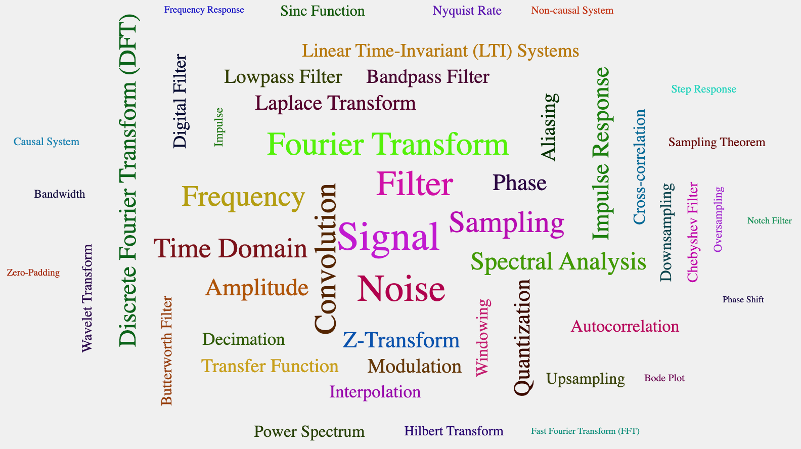

# About the Signal Processing with AI Website

This website is designed as a proof-of-concept site to help both instructors and students who are interested in learning about how AI can be used to teach signal processing.  

!!! Warning
    This is not a complete course on signal processing.  It is a course
    that helps instructors and students learn how to use generative AI
    tools to create content in a signal processing course.

This
website uses generative AI to create content around a learning graph and encourages both instructors
and students to use generative AI to create and modify
content such as simulations and animations of signal processing
concepts.

We have used the following workflow to generate much of this website.

<iframe src="../sims/book-gen-workflow/main.html" height="610px" scrolling="no"
  style="overflow: hidden;"></iframe>

You can hover various items to see what tasks they execute.

## What is Signal Processing?

**Signal Processing** is the analysis, manipulation, and interpretation of signals to extract meaningful information, enhance signal quality, or transform signals into more useful forms.

### Core Definition

Signal processing involves mathematical and computational techniques applied to time-varying data (signals) such as audio, video, sensor measurements, or communication data. The field encompasses both analog and digital methods for filtering, amplifying, modulating, compressing, and analyzing signals to achieve specific objectives like noise reduction, feature extraction, or data compression.

### Key Characteristics

**Input**: Raw signals from various sources (microphones, cameras, sensors, antennas)

**Processing**: Mathematical operations including filtering, transformation, correlation, and statistical analysis

**Output**: Enhanced, modified, or analyzed signals that serve specific applications

### Fundamental Applications

Signal processing is essential in telecommunications, audio/video systems, medical imaging, radar, control systems, and data analysis. Common operations include removing unwanted noise from audio recordings, compressing images for storage, extracting features from sensor data, and converting analog signals to digital format for computer processing.

### Mathematical Foundation

The discipline relies heavily on concepts from linear algebra, calculus, probability theory, and Fourier analysis to represent signals in different domains (time, frequency, spatial) and apply appropriate transformations to achieve desired results.

