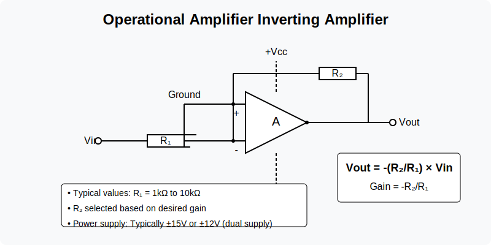

## Operational Amplifier (Op-Amp) Inverting Amplifier
### Importance in Signal Processing
The inverting amplifier is fundamental for signal conditioning, providing precise gain control with phase inversion. It's often the first practical circuit students learn when studying signal processing, demonstrating basic feedback principles and serving as a building block for more complex filters and signal manipulation circuits.

### Circuit Description
An op-amp circuit that produces an output signal that's amplified and inverted (180° phase shift) compared to the input signal. The gain is determined by the ratio of feedback resistor to input resistor.

### Key Components
- Operational amplifier (typically 741, LM358, or TL072)
- Input resistor (R₁): 1kΩ to 10kΩ (determines input impedance)
- Feedback resistor (R₂): Value depends on desired gain (R₂/R₁)
- Power supply: Typically ±15V or ±12V (dual supply)

## Circuit Diagram

## Key Features of the Inverting Amplifier

1.  **Circuit Operation**: The inverting amplifier takes an input signal and produces an output signal that is amplified and phase-inverted (180° phase shift).

2.  **Components**:

    -   Operational amplifier (typically 741, LM358, or TL072)
    -   Input resistor (R₁): Typically 1kΩ to 10kΩ
    -   Feedback resistor (R₂): Value depends on desired gain
    -   Dual power supply (±15V or ±12V)

3.  **Gain Formula**:

    -   Vout = -(R₂/R₁) × Vin
    -   The negative sign indicates phase inversion

4.  **Applications in Signal Processing**:

    -   Signal conditioning
    -   Active filtering
    -   Precise gain control
    -   Summing amplifier (when multiple inputs are used)
    -   Basic building block for more complex circuits

The inverting configuration is one of the most commonly used op-amp circuits, providing predictable gain with excellent linearity when operated within the op-amp's limitations.