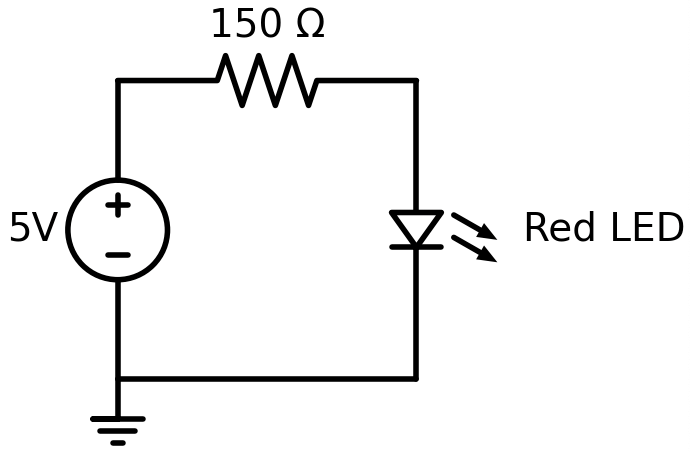
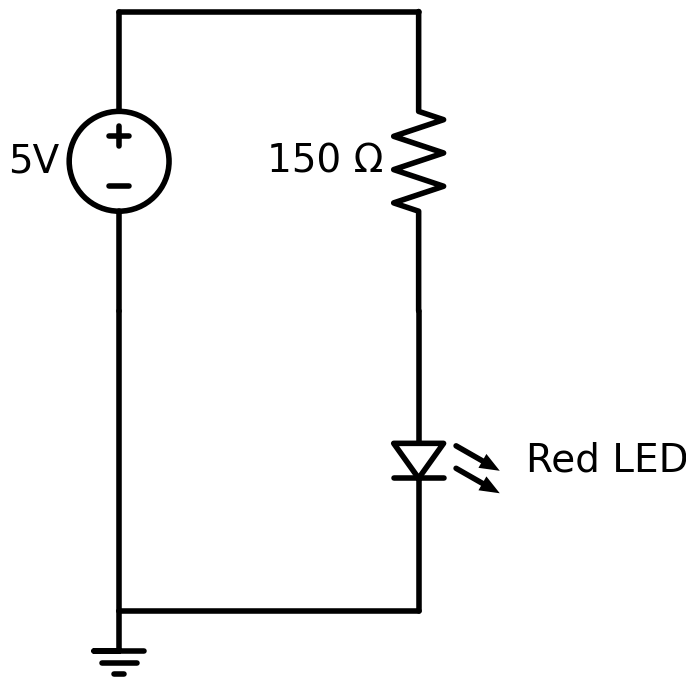
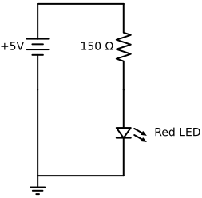

# Schemadraw

SchemaDraw is a python library that converts a high-level
placement file of components directly into a detailed
circuit drawing in SVG.

## Simple LED Circuit Example

```python
import schemdraw
import schemdraw.elements as elm

with schemdraw.Drawing():
    elm.Resistor().label('150Ω')
    elm.LED().down().label('Red LED')
    elm.Line().left()
    elm.Ground()
    elm.SourceV().up().label('5V')
```



## LED Circuit Right Side

```python
import schemdraw
import schemdraw.elements as elm

with schemdraw.Drawing():
    elm.SourceV().up().label('5V')
    elm.Line().right()
    elm.Resistor().down().label('150 Ω')
    elm.LED().label('Red LED')
    elm.Line().left()
    elm.Ground()
    elm.Line().up()
```



## Saving SVG and PNG

```py
from schemdraw import Drawing
import schemdraw.elements as elm
import matplotlib.pyplot as plt

with Drawing(file='led-circuit-battery.svg') as d:
    # Vertical battery on the left with "+" on top
    vsrc = d.add(elm.Battery().up().reverse().label('+5V', loc='top'))
    
    # Top branch - just a wire at the top
    d += elm.Line().right()

    # Right side of the circuit vertical resistor to LED
    d += elm.Resistor().down().label('150 Ω')
    d += elm.LED().down().label('Red LED')
    
    # Horizontal line back toward the battery
    d += elm.Line().left().length(3)
    
    # Draw ground here
    gnd = d.add(elm.Ground())
    
    # Connect ground up to the negative battery terminal with a separate line
    # Draw a vertical line up from the ground to the negative terminal
    # Do not draw over the battery
    d += elm.Line().up().length(3)

    # Save PNG with white background
    fig = d.draw(show=False)
    plt.savefig('led-circuit-battery.png', dpi=300, bbox_inches='tight', facecolor='white')
```

Note the battery has the ```reverse()``` method for positive polarity on the top.



## Setup SchemaDraw
```sh
$ conda create -n schemadraw python=3
$ conda deactivate
(base) src/schemadraw $ conda activate schemadraw
(schemadraw) src/schemadraw $ pip install schemdraw[matplotlib]
Collecting schemdraw
  Downloading schemdraw-0.20-py3-none-any.whl.metadata (2.2 kB)
Downloading schemdraw-0.20-py3-none-any.whl (151 kB)
Installing collected packages: schemdraw
Successfully installed schemdraw-0.20
```

## References

[SchemaDraw Documentation Website](https://schemdraw.readthedocs.io/en/stable/index.html)

