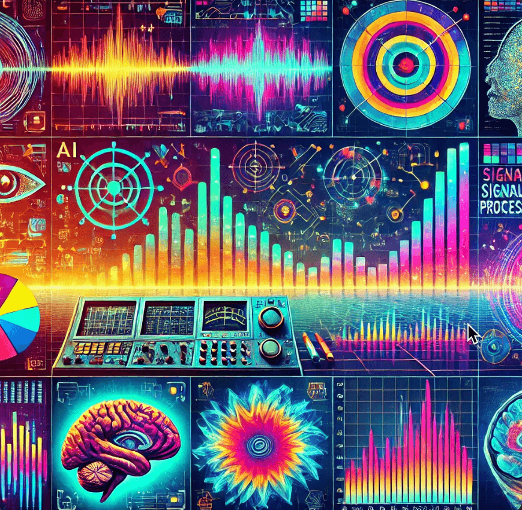

# Signal Processing

Welcome to our website on Signal Processing with AI.

[Table of Contents](./chapters/index.md)

This is a new innovative  signal processing course that
leverages the latest generative AI
technologies to create a fun and engaging content for a wide
audience of students with various math backgrounds.

See our [About](./about.md).

All content is licensed under [Creative Commons Attribution NonCommercial ShareAlike](./license.md).

Please use the [GitHub Discussions](https://github.com/dmccreary/signal-processing/discussions/1) for questions or comments.

Please contact me on [LinkedIn](https://www.linkedin.com/in/danmccreary/) if you would like to join our group.

Thanks! - Dan

## Change Log

* [January 11, 2024 - Added 100 Signal Processing Equations](./prompts/12-equations.md)

