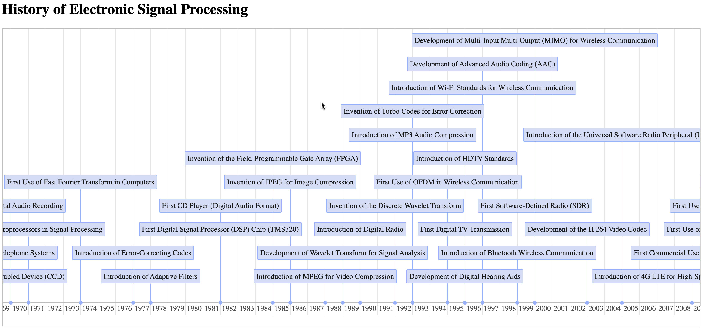

# Timeline of Signal Processing



[Timeline Viewer](../sims/timeline-viewer/timeline-viewer.html)

## Prompt

```linenums="0"
Create a timeline of the 50 most important milestones in the history of electronic signal processing.  Use the vis.js format to store the events in a JSON format.
```

## Response

Here is a timeline of 50 key milestones in the history of electronic signal processing, represented in the `vis.js` format:

```json
{
  "items": [
    { "id": 1, "content": "Invention of the Telegraph", "start": "1837" },
    { "id": 2, "content": "Invention of the Telephone by Alexander Graham Bell", "start": "1876" },
    { "id": 3, "content": "First Radio Transmission by Guglielmo Marconi", "start": "1895" },
    { "id": 4, "content": "Discovery of the Electron", "start": "1897" },
    { "id": 5, "content": "Invention of the Vacuum Tube (Thermionic Valve)", "start": "1904" },
    { "id": 6, "content": "Nyquist-Shannon Sampling Theorem", "start": "1928" },
    { "id": 7, "content": "First FM Radio Transmission", "start": "1933" },
    { "id": 8, "content": "Development of Radar Systems during WWII", "start": "1939" },
    { "id": 9, "content": "Invention of the Transistor at Bell Labs", "start": "1947" },
    { "id": 10, "content": "Introduction of Pulse Code Modulation (PCM)", "start": "1948" },
    { "id": 11, "content": "Invention of the Operational Amplifier (Op-Amp)", "start": "1960" },
    { "id": 12, "content": "Introduction of the Fast Fourier Transform (FFT)", "start": "1965" },
    { "id": 13, "content": "Development of Digital Filters", "start": "1966" },
    { "id": 14, "content": "First Commercial Use of PCM in Telephone Systems", "start": "1968" },
    { "id": 15, "content": "Invention of the Charge-Coupled Device (CCD)", "start": "1969" },
    { "id": 16, "content": "Advent of Digital Audio Recording", "start": "1970" },
    { "id": 17, "content": "First Use of Microprocessors in Signal Processing", "start": "1971" },
    { "id": 18, "content": "First Use of Fast Fourier Transform in Computers", "start": "1974" },
    { "id": 19, "content": "Introduction of Error-Correcting Codes", "start": "1977" },
    { "id": 20, "content": "Introduction of Adaptive Filters", "start": "1978" },
    { "id": 21, "content": "First Digital Signal Processor (DSP) Chip (TMS320)", "start": "1982" },
    { "id": 22, "content": "Invention of JPEG for Image Compression", "start": "1986" },
    { "id": 23, "content": "Introduction of MPEG for Video Compression", "start": "1988" },
    { "id": 24, "content": "First CD Player (Digital Audio Format)", "start": "1982" },
    { "id": 25, "content": "Development of Wavelet Transform for Signal Analysis", "start": "1989" },
    { "id": 26, "content": "Introduction of MP3 Audio Compression", "start": "1993" },
    { "id": 27, "content": "Invention of the Discrete Wavelet Transform", "start": "1992" },
    { "id": 28, "content": "First Use of OFDM in Wireless Communication", "start": "1995" },
    { "id": 29, "content": "Development of Digital Hearing Aids", "start": "1996" },
    { "id": 30, "content": "Introduction of HDTV Standards", "start": "1996" },
    { "id": 31, "content": "First Software-Defined Radio (SDR)", "start": "2000" },
    { "id": 32, "content": "Introduction of Wi-Fi Standards for Wireless Communication", "start": "1997" },
    { "id": 33, "content": "Development of the H.264 Video Codec", "start": "2003" },
    { "id": 34, "content": "Introduction of 4G LTE for High-Speed Wireless Communication", "start": "2009" },
    { "id": 35, "content": "First Use of Deep Learning in Signal Processing", "start": "2012" },
    { "id": 36, "content": "Introduction of 5G Standards for Wireless Communication", "start": "2020" },
    { "id": 37, "content": "Development of Advanced Audio Coding (AAC)", "start": "1997" },
    { "id": 38, "content": "Invention of the Field-Programmable Gate Array (FPGA)", "start": "1985" },
    { "id": 39, "content": "Invention of the Kalman Filter for Optimal Estimation", "start": "1960" },
    { "id": 40, "content": "Development of Multi-Input Multi-Output (MIMO) for Wireless Communication", "start": "2000" },
    { "id": 41, "content": "Introduction of Digital Radio", "start": "1990" },
    { "id": 42, "content": "Introduction of Bluetooth Wireless Communication", "start": "1999" },
    { "id": 43, "content": "First Digital TV Transmission", "start": "1996" },
    { "id": 44, "content": "Invention of Turbo Codes for Error Correction", "start": "1993" },
    { "id": 45, "content": "Development of the H.265 Video Codec", "start": "2013" },
    { "id": 46, "content": "First Commercial Use of Software-Defined Networking (SDN)", "start": "2011" },
    { "id": 47, "content": "First Use of Cognitive Radio", "start": "2010" },
    { "id": 48, "content": "Introduction of Low-Power Wide-Area Network (LPWAN)", "start": "2016" },
    { "id": 49, "content": "Introduction of the Universal Software Radio Peripheral (USRP)", "start": "2005" },
    { "id": 50, "content": "First Commercial Use of Cloud-Based Signal Processing", "start": "2022" }
  ]
}
```

This JSON timeline can be loaded into a `vis.js` application to visualize the history of electronic signal processing.

##### You said:

Assume the file above is called events.json. Create a vis.js timeline viewer of these events. Create separate HTML and JavaScript file that will view the events using the vis.js timeline libraries.

###### ChatGPT said:

To view the `events.json` file in a `vis.js` timeline, you need two files: an HTML file to create the page and include the necessary libraries, and a JavaScript file to load and display the events.

Here's how to set it up:

### 1\. **HTML File** (`index.html`)

```html
<!DOCTYPE html>
<html lang="en">
<head>
  <meta charset="UTF-8">
  <meta name="viewport" content="width=device-width, initial-scale=1.0">
  <title>Signal Processing Milestones Timeline</title>
  <script src="https://cdnjs.cloudflare.com/ajax/libs/vis/4.21.0/vis.min.js"></script>
  <link href="https://cdnjs.cloudflare.com/ajax/libs/vis/4.21.0/vis.min.css" rel="stylesheet">
  <style>
    #timeline {
      width: 100%;
      height: 600px;
      border: 1px solid lightgray;
    }
  </style>
</head>
<body>
  <h1>History of Electronic Signal Processing</h1>
  <div id="timeline"></div>

  <script src="timeline.js"></script>
</body>
</html>
```

### 2\. **JavaScript File** (`timeline.js`)

```javascript
// Load the events from the events.json file
fetch('events.json')
  .then(response => response.json())
  .then(data => {
    // Create a DataSet with the events
    var items = new vis.DataSet(data.items);

    // Configuration for the Timeline
    var options = {
      start: '1800',
      end: '2030',
      editable: false,
      margin: {
        item: 20,
        axis: 40
      }
    };

    // Create a Timeline and link it to the DOM element with id 'timeline'
    var timeline = new vis.Timeline(document.getElementById('timeline'), items, options);
  })
  .catch(error => console.error('Error loading events:', error));
```

### 3\. **Events JSON File** (`events.json`)

Save the `events.json` file that you already have in the same directory as the HTML and JavaScript files.

### Steps to Run:

1.  Ensure that you have all three files (`index.html`, `timeline.js`, and `events.json`) in the same directory.
2.  Open the `index.html` file in a web browser.
3.  The timeline should load, displaying the milestones in the history of electronic signal processing.

This setup leverages the `vis.js` timeline library, fetching the `events.json` file and rendering it in a timeline view.

##### You said:

How can I set the zoom level and keep it fixed?

###### ChatGPT said:

To set the zoom level and keep it fixed in `vis.js`, you can adjust the `options` object. Specifically, you can use the `min` and `max` options to define the boundaries of the timeline, and the `zoomMin` and `zoomMax` options to prevent users from zooming in or out.

Here's how you can modify the `options` object in your `timeline.js` file:

### Updated `timeline.js`

```javascript
// Load the events from the events.json file
fetch('events.json')
  .then(response => response.json())
  .then(data => {
    // Create a DataSet with the events
    var items = new vis.DataSet(data.items);

    // Configuration for the Timeline
    var options = {
      start: '1800',
      end: '2030',
      min: '1800',  // Set the minimum visible date
      max: '2030',  // Set the maximum visible date
      zoomMin: 31536000000,  // Minimum zoom level (e.g., 1 year in milliseconds)
      zoomMax: 315360000000, // Maximum zoom level (e.g., 10 years in milliseconds)
      editable: false,
      margin: {
        item: 20,
        axis: 40
      }
    };

    // Create a Timeline and link it to the DOM element with id 'timeline'
    var timeline = new vis.Timeline(document.getElementById('timeline'), items, options);
  })
  .catch(error => console.error('Error loading events:', error));
```

### Explanation:

1.  **`min` and `max`**: These options set the minimum and maximum dates that are visible on the timeline. The user cannot pan or scroll beyond these dates.

    -   `min: '1800'`: The earliest visible date is set to 1800.
    -   `max: '2030'`: The latest visible date is set to 2030.
2.  **`zoomMin` and `zoomMax`**: These options control the minimum and maximum zoom levels.

    -   `zoomMin: 31536000000`: The minimum zoom level is set to 1 year, which means users can zoom in to view a single year.
    -   `zoomMax: 315360000000`: The maximum zoom level is set to 10 years, so users cannot zoom out beyond 10 years in the timeline.

You can adjust the `zoomMin` and `zoomMax` values based on how zoomed in or out you want the timeline to be.

This configuration will keep the zoom level fixed and prevent users from zooming beyond the specified levels.

##### You said:

I want the years to be about 1/4 inch apart and I don't want the users to ever zoom in to months. I want the initial view to be 1940 to 1980.

###### ChatGPT said:

ChatGPT

To achieve the following:

1.  **Initial view** from 1940 to 1980.
2.  **Year spacing** of about 1/4 inch apart.
3.  **No zooming in to the month level** (keep zoom level at the year level or higher).

You can adjust the `options` for the timeline as follows:

### Updated `timeline.js`

```javascript
// Load the events from the events.json file
fetch('events.json')
  .then(response => response.json())
  .then(data => {
    // Create a DataSet with the events
    var items = new vis.DataSet(data.items);

    // Configuration for the Timeline
    var options = {
      start: '1940',  // Set the initial visible start date
      end: '1980',    // Set the initial visible end date
      min: '1800',    // Set the minimum visible date
      max: '2030',    // Set the maximum visible date
      zoomMin: 31536000000,  // Minimum zoom level (e.g., 1 year in milliseconds)
      zoomMax: 315360000000, // Maximum zoom level (e.g., 10 years in milliseconds)
      moveable: false,  // Disable user panning
      zoomable: true,   // Allow zooming but within bounds defined
      editable: false,  // Disable editing

      // Configure axis scaling to achieve approximately 1/4 inch per year
      timeAxis: { scale: 'year', step: 1 },  // Ensure the axis shows year labels only
      width: '100%',
      margin: {
        item: 20,
        axis: 40
      }
    };

    // Create a Timeline and link it to the DOM element with id 'timeline'
    var timeline = new vis.Timeline(document.getElementById('timeline'), items, options);

    // Ensure that users cannot zoom in past a certain level (e.g., months)
    timeline.on('rangechange', function (event) {
      var range = timeline.getWindow();
      var interval = range.end - range.start;

      // Lock the zoom level to years or more (no zooming into months)
      if (interval < 31536000000) {  // 1 year in milliseconds
        timeline.setWindow(range.start, new Date(range.start.getFullYear() + 1, 0, 1));
      }
    });
  })
  .catch(error => console.error('Error loading events:', error));
```

### Key Changes Explained:

1.  **Initial view from 1940 to 1980**: The `start` and `end` parameters are set to `'1940'` and `'1980'` respectively to ensure the timeline initially displays this range.

2.  **Year spacing of 1/4 inch apart**: This is handled by setting the `timeAxis.scale` to `'year'` and using `step: 1` to show each year clearly. You can adjust the overall zoom levels if you need the visual spacing to change, but this will ensure consistent year intervals.

3.  **No zooming in to months**: The `rangechange` event listener checks if the user tries to zoom in below 1 year (which would be months) and automatically resets the view to a yearly scale. The condition `interval < 31536000000` ensures that if the range becomes less than 1 year, it will lock it back to 1 year.

4.  **Moveable and zoomable options**: You can disable user panning by setting `moveable: false` but still allow zooming within the specified year ranges.

This configuration will ensure the timeline starts with 1940 to 1980, shows about 1/4 inch between years, and prevents users from zooming in to the month level.

##### You said:

How can I set the initial zoom level to show a 40 year span?

###### ChatGPT said:

To set the initial zoom level to show a **40-year span** when the timeline first loads, you can adjust the `start` and `end` properties in the `options` to cover the 40-year range. You don't need to rely on user interactions or event listeners for this. The `start` and `end` properties define the visible date range when the timeline is first rendered.

Here's how you can configure it:

### Updated `timeline.js`

```javascript
// Load the events from the events.json file
fetch('events.json')
  .then(response => response.json())
  .then(data => {
    // Create a DataSet with the events
    var items = new vis.DataSet(data.items);

    // Configuration for the Timeline
    var options = {
      start: '1940',  // Set the initial visible start date
      end: '1980',    // Set the initial visible end date (40-year span)
      min: '1800',    // Set the minimum visible date
      max: '2030',    // Set the maximum visible date
      zoomMin: 31536000000,  // Minimum zoom level (1 year in milliseconds)
      zoomMax: 1261440000000, // Maximum zoom level (40 years in milliseconds)
      moveable: false,  // Disable user panning
      zoomable: true,   // Allow zooming but within bounds
      editable: false,  // Disable editing

      // Configure axis scaling to show the years clearly
      timeAxis: { scale: 'year', step: 1 },  // Ensure the axis shows year labels only
      width: '100%',
      margin: {
        item: 20,
        axis: 40
      }
    };

    // Create a Timeline and link it to the DOM element with id 'timeline'
    var timeline = new vis.Timeline(document.getElementById('timeline'), items, options);

    // Ensure that users cannot zoom in past a certain level (no zooming into months)
    timeline.on('rangechange', function (event) {
      var range = timeline.getWindow();
      var interval = range.end - range.start;

      // Lock the zoom level to years or more (no zooming into months)
      if (interval < 31536000000) {  // 1 year in milliseconds
        timeline.setWindow(range.start, new Date(range.start.getFullYear() + 1, 0, 1));
      }
    });
  })
  .catch(error => console.error('Error loading events:', error));
```

### Explanation:

1.  **Initial 40-year span (1940 to 1980)**:

    -   The `start` is set to `'1940'`.
    -   The `end` is set to `'1980'`. This ensures that when the timeline first loads, it shows a 40-year period.
2.  **Prevent zooming in to months**:

    -   The `rangechange` event listener checks if the user zooms in beyond a 1-year level and resets it if necessary.
3.  **Zoom Levels**:

    -   `zoomMin` is set to `31536000000` (1 year in milliseconds) to prevent zooming in closer than a year.
    -   `zoomMax` is set to `1261440000000` (40 years in milliseconds), ensuring that the maximum zoom level covers a larger time span but starts with 40 years initially.

With this setup, the timeline will load showing the desired 40-year range (from 1940 to 1980), and users won't be able to zoom in closer than the yearly level.
