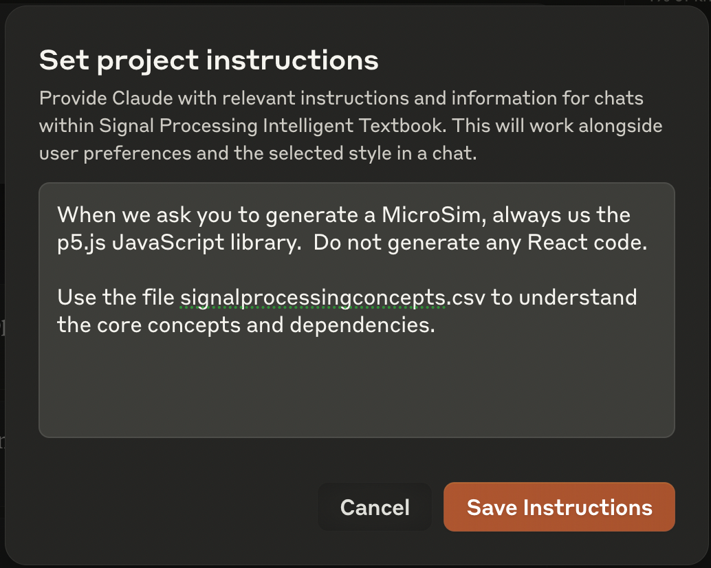

# How to Use Projects to Increase Generation Quality

Both OpenAI and Anthropic support the concept of "Projects".  These
are folders related to a specific task that are used to create a more
precise context for your task.

## Anthropic Project Example

This feature requires you use the $20 paid version of Anthropic.  If you are generating many signal processing labs, it is well worth the investment.

When you create a project, you can set a "system prompt" for any tasks done within that project.

