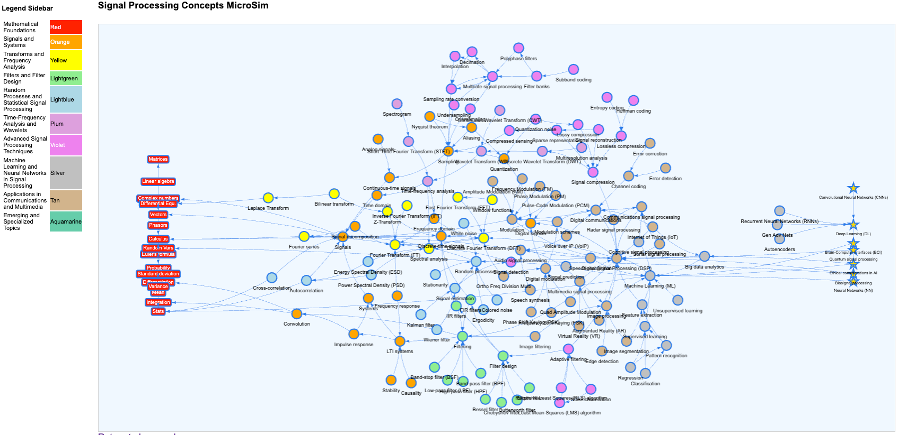

# Learning Graph Viewer



[Run the Learning Graph Viewer MicroSim Fullscreen](main.html){ .md-button .md-button--primary }

Here are the changes we made to a standard vis.js template
to pin the foundation nodes to the left and the goal nodes
to the right.

```javascript
// Extract nodes from the JSON data
const nodes = new vis.DataSet(data.nodes);

// Function to fix the x positions for foundation and goal groups after JSON load
// and set red boxes for foundation and gold stars for goals
nodes.forEach(function (node) {
    if (node.group === "found") {
        node.x = -900;
        node.fixed = { x: true, y: false }; // Fix x, but let y be adjusted by physics
        node.shape = "box";
        node.color = "red";
        node.font = {"color": "white"};
    } else if (node.group === "goal") {
        node.x = 900;
        node.fixed = { x: true, y: false }; // Fix x, but let y be adjusted by physics
        node.shape = "star";
        node.color = "gold";
    }
});
```

## Adding Styling

[View JSON Graph V2](view-graph-v2.html)

[View Leaning Graph with Sidebar V3](view-graph-v3.html)