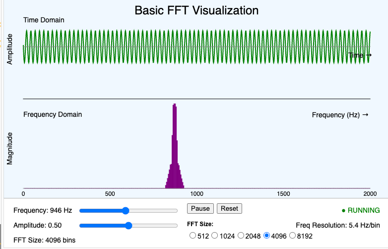

# Signal Processing MicroSims

Interactive Micro Simulations to help students learn signal processing fundamentals.

- **[AI Pace](./ai-pace-accelerating/index.md)**

    

    Interactive visualization showing the exponential growth and acceleration of AI capabilities over time.

- **[Analog Modulation](./analog-mod/index.md)**

    

    Interactive demonstration of analog modulation techniques used in signal transmission.

- **[Bass and Treble](./base-and-treble/index.md)**

    

    Interactive simulation of classic amplifier frequency response with adjustable bass and treble controls.

- **[Basic FFT](./fft-basic/index.md)**

    

    A basic demonstration of FFT with time domain on top and frequency domain on bottom.

- **[Bloom's Taxonomy](./blooms-taxonomy/index.md)**

    

    Interactive visualization of Bloom's Taxonomy cognitive levels for educational design.

- **[Book Generation Workflow](./book-gen-workflow/index.md)**

    

    Interactive infographic showing the workflow for building intelligent textbooks.

- **[Book Levels](./book-levels/index.md)**

    

    Interactive visualization showing the five levels of intelligent textbooks from static to autonomous AI.

- **[Citation Graph](./citation-graph/index.md)**

    

    A citation graph for FFT Microcontrollers running under vis.js.

- **[Complex Plane](./complex-plane/index.md)**

    

    Interactive visualization of complex numbers showing rectangular and polar forms with geometric representations.

- **[Convolution](./convolution/index.md)**

    

    Interactive visualization demonstrating convolution as a measure of overlap between functions.

- **[Euler's Formula Explorer](./euler-formula-explorer/index.md)**

    

    Interactive visualization demonstrating Euler's formula with synchronized unit circle rotation and wave traces.

- **[FFT 2 Oscillators](./fft-2-osc/index.md)**

    

    FFT demonstration with two oscillators showing superposition of sine waves in time and frequency domains.

- **[FFT 3 Oscillators](./fft-3-osc/index.md)**

    

    FFT demonstration with three oscillators showing superposition of sine waves in time and frequency domains.

- **[FFT Butterfly](./fft-butterfly/index.md)**

    

    Visualization of the FFT butterfly algorithm showing how the Fast Fourier Transform breaks down computation.

- **[FFT From Microphone](./fft-mic/index.md)**

    

    Shows the frequency spectrum of sound from a microphone using the p5.js FFT library.

- **[FFT Live Audio](./fft-live-audio/index.md)**

    

    Display the frequency spectrum from live audio with adjustable parameters.

- **[FFT Size](./fft-size/index.md)**

    

    Demonstration of FFT on a single oscillator with controls to adjust the FFT size.

- **[FFT Sound File](./fft-sound-file/index.md)**

    

    Shows the frequency spectrum of an MP3 sound file.

- **[FFT Waveform Types](./fft-waveform-types/index.md)**

    

    Shows how different waveform shapes (sine, square, triangle, sawtooth) appear in the frequency domain.

- **[Frequency Detection](./frequency-detection/index.md)**

    

    Interactive frequency detection demonstration for audio signals.

- **[Learning Graph V1](./graph-viewer-v1/index.md)**

    

    First version of the learning graph viewer with pinned foundation and goal nodes.

- **[Learning Graph Viewer](./graph-viewer/index.md)**

    

    Interactive visualization of learning graphs showing concept dependencies and taxonomy filtering.

- **[Mobius Transformation](./mobius-transform/index.md)**

    

    Interactive visualization of Mobius transformations in the complex plane.

- **[Nyquist-Shannon Sampling](./nyquist-shannon-sampling/index.md)**

    

    Demonstrates the Nyquist-Shannon sampling theorem and the concept of aliasing.

- **[RC Lowpass Filter](./rc-lowpass-filter/index.md)**

    

    Creates a Bode Plot showing phase and magnitude for any RC filter combination.

- **[Reverb Effect](./reverb/index.md)**

    

    Interactive demonstration of audio reverb effect showing how reverberation affects sound signals.

- **[Sine Wave](./sine-wave/index.md)**

    

    Interactive demonstration of sine wave parameters including amplitude, period, and phase.

- **[Synth Timeline](./synth-timeline/index.md)**

    

    Interactive timeline visualization of synthesizer history and evolution.

- **[Timeline Viewer](./timeline-viewer/index.md)**

    

    Interactive timeline of key milestones in signal processing history.

- **[Tone Generator](./tone-gen/index.md)**

    

    Interactive tone generator allowing users to create and hear audio tones at different frequencies.

- **[Word Cloud](./wordcloud/index.md)**

    

    Word cloud visualization of key signal processing terms and concepts.

