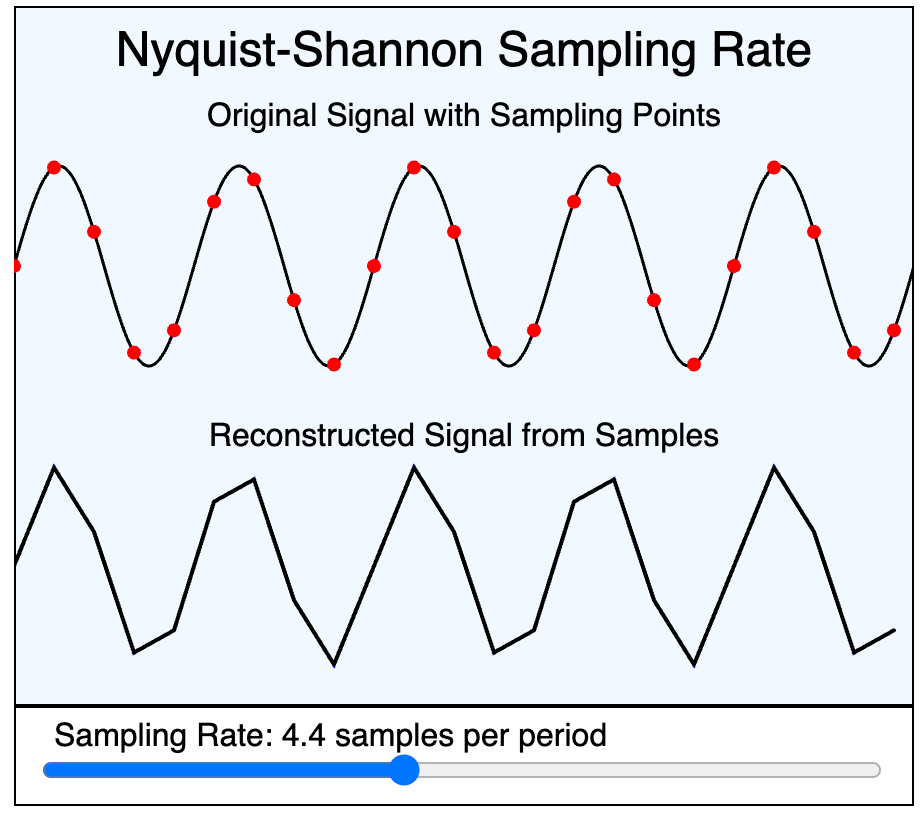

# Nyquist-Shannon Sampling

{ .md-button .md-button--primary }

[Run the Nyquist-Shannon Sampling MicroSim](nyquist-shannon-sampling.html)
[Edit This MicroSim](https://editor.p5js.org/dmccreary/sketches/I95-hiV6z)

```linenums="0"
Please help me create a p5.js simulation that helps
students understand Sampling and Aliasing. The Nyquist-Shannon
sampling theorem and the concept of aliasing involve understanding
how continuous signals are represented in discrete form. Grasping
how undersampling leads to frequency overlap (aliasing) can be non-intuitive.

I would like an Interactive p5.js program that can demonstrate how
varying the sampling rate affects the reconstructed signal.
By adjusting parameters in real-time, students can visualize
aliasing effects and the importance of adhering to the Nyquist rate.

Please create a p5.js simulation that allows students to use a
slider to adjust the sampling rate for a waveform using a slider.
Display two waveforms. One is the input with the samples drawn
as radius 7 red circles. The second waveform is one done from
the reconstruction of the sampling points.
Place the original on the top and the reconstruction under
the original.

Use the following template:
```

```javascript
// region drawing parameters
// the width of the entire canvas
let canvasWidth = 400;
// The top drawing region above the interactive controls
let drawHeight = 400;
// control region height
let controlHeight = 50;
// The total hight of both the drawing region height + the control region height
let canvasHeight = 450;
// margin around the active plotting region
let margin = 25;
// larger text so students in the back of the room can read the labels
let defaultTextSize = 16;

function setup {
    const canvas = createCanvas(canvasWidth, canvasHeight);
    // canvas.parent('canvas-container');
    var mainElement = document.querySelector('main');
    canvas.parent(mainElement);
    textSize(defaultTextSize);

    // create a new slider at th bottom of the canvas
    mySlider = createSlider(0, 100, 50, 1);
    mySlider.position(sliderLeftMargin, drawHeight + 12);
    mySlider.size(canvasWidth - 2*margin);

}

function draw() {
    // make the background drawing region a very light blue
    fill('aliceblue');
    rect(0, 0, canvasWidth, drawHeight);
    // make the background of the controls area white
    fill('white')
    rect(0, drawHeight, canvasWidth, controlHeight);

    // get the updated slider value
    val = mySlider.value();

    // put your custom code here


    // draw label and value
    text("MySlider: " +  val, 10, drawHeight + 25)
}
```

### ChatGPT Response 

o1-preview Thought for 6 seconds

Sure! Below is a p5.js simulation that demonstrates sampling and aliasing. You can adjust the sampling rate using a slider to see how it affects the reconstructed signal.

### Simulation Code

```javascript
// Nyquist-Shannon Sampling Rate MicroSim
// region drawing parameters
// the width of the entire canvas
let canvasWidth = 450;
// The top drawing region above the interactive controls
let drawHeight = 350;
// control region height
let controlHeight = 50;
// The total height of both the drawing region height + the control region height
let canvasHeight = drawHeight + controlHeight;
// margin around the active plotting region
let margin = 30;
// larger text so students in the back of the room can read the labels
let defaultTextSize = 16;

let samplingRateSlider;
let samplingRate = 22; // Initial sampling rate
let signalFrequency = 5; // Frequency of the original signal
let time = [];
let signal = [];
let sampledSignal = [];

function setup() {
  createCanvas(canvasWidth, canvasHeight);
  const canvas = createCanvas(canvasWidth, canvasHeight);
  var mainElement = document.querySelector('main');
  canvas.parent(mainElement);
  textSize(defaultTextSize);

  // slider to allow the user to select the sampling rate
  samplingRateSlider = createSlider(1, 50, samplingRate, .1);
  samplingRateSlider.position(20, drawHeight + 30);
  samplingRateSlider.size(canvasWidth - margin);

  // Generate time values
  for (let t = 0; t <= width; t++) {
    time.push(t);
  }

  // Generate original signal values
  for (let i = 0; i < time.length; i++) {
    let t = time[i];
    signal[i] = sin(TWO_PI * signalFrequency * (t / width));
  }
}

function draw() {
  // Fill the drawing region background with 'aliceblue'
  fill('aliceblue');
  stroke('black');
  rect(0, 0, canvasWidth, drawHeight);

  // Fill the control region background with 'white'
  fill('white');
  rect(0, drawHeight, canvasWidth, controlHeight);

  samplingRate = samplingRateSlider.value();

  // Draw title
  textSize(24);
  fill('black');
  strokeWeight(0);
  textAlign(CENTER);
  text('Nyquist-Shannon Sampling Rate', canvasWidth / 2, 30);

  // Draw labels
  textSize(16);
  fill('black');
  strokeWeight(0);
  textAlign(CENTER);
  text('Original Signal with Sampling Points', canvasWidth / 2, 60);
  text('Reconstructed Signal from Samples', canvasWidth / 2, drawHeight / 2 + 45);
  textAlign(LEFT);
  text('Sampling Rate: ' + round(samplingRate/5,2) + ' samples per period', 20, drawHeight + 20);

  // Draw original signal
  stroke(0);
  noFill();
  strokeWeight(1.5);
  beginShape();
    for (let i = 0; i < signal.length; i++) {
      let y = map(signal[i], -1, 1, 100, 0);
      vertex(time[i], y + 80);
    }
  endShape();

  // Sample the signal
  sampledSignal = [];
  let sampleInterval = floor(width / samplingRate);
  for (let i = 0; i < time.length; i += sampleInterval) {
    let y = map(signal[i], -1, 1, 100, 0);
    sampledSignal.push({ x: time[i], y: y + 30 });
    // Draw sampling points
    fill(255, 0, 0);
    noStroke();
    circle(time[i], y + 80, 7);
  }

  // Reconstruct the signal from samples
  stroke('blue');
  strokeWeight(2);
  noFill();
  beginShape();
  for (let i = 0; i < sampledSignal.length; i++) {
    vertex(sampledSignal[i].x, sampledSignal[i].y + height / 2);
  }
  endShape();

  // Draw reconstructed signal
  stroke(0);
  noFill();
  beginShape();
  for (let i = 0; i < sampledSignal.length - 1; i++) {
    let x1 = sampledSignal[i].x;
    let y1 = sampledSignal[i].y + height / 2;
    let x2 = sampledSignal[i + 1].x;
    let y2 = sampledSignal[i + 1].y + height / 2;
    line(x1, y1, x2, y2);
  }
  endShape();
}
```

### How to Use the Simulation

1.  **Adjust the Sampling Rate**: Use the slider at the bottom of the canvas to change the sampling rate. The sampling rate is displayed above the slider.

2.  **Observe the Top Graph**: The top waveform represents the original signal. Red circles indicate the sampling points based on the current sampling rate.

3.  **Observe the Bottom Graph**: The bottom waveform is reconstructed from the sampled points. As you adjust the sampling rate, notice how the reconstructed signal changes.

### Explanation of the Code

#### Variables

-   `samplingRateSlider`: The slider control for adjusting the sampling rate.
-   `samplingRate`: The current sampling rate value from the slider.
-   `signalFrequency`: The frequency of the original signal.
-   `time`, `signal`, `sampledSignal`: Arrays to store time values, original signal values, and sampled signal points, respectively.

#### setup()` Function

-   Initializes the canvas and the slider.
-   Generates time values and computes the original signal using a sine function.

#### `draw()` Function

-   Clears the background and updates the sampling rate from the slider.
-   Draws labels and the original signal waveform.
-   Samples the original signal at intervals based on the sampling rate and draws red circles at the sampling points.
-   Reconstructs the signal from the sampled points and draws it in the bottom half of the canvas.

### Key Concepts Demonstrated

-   **Sampling Rate**: The number of samples taken per period of the signal. A higher sampling rate captures the signal more accurately.

-   **Aliasing**: When the sampling rate is too low (below the Nyquist rate), the reconstructed signal may differ significantly from the original, demonstrating aliasing effects.

### Running the Simulation

To run this simulation:

1.  Copy the code above.
2.  Go to the p5.js online editor.
3.  Paste the code into the editor.
4.  Click the "Play" button to start the simulation.

Feel free to experiment with different signal frequencies or modify the code to explore further concepts related to sampling and aliasing.
