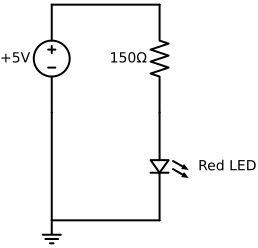

!!! prompt
    Please generate an SVG image of a LED circuit.  It has a 5 volt power supply and a red LED. What resistor value should I use to get 20 milliamps of current?

To calculate the resistor value needed to achieve **20 mA** current for a **red LED** powered by a **5V supply**, we can use **Ohm’s Law**:

### **Formula:**

$$
R = \frac{V_{supply} - V_{LED}}{I}
$$

### **Assumptions:**

* **Typical forward voltage for a red LED:** \~2.0V
* **Desired current (I):** 20 mA = 0.020 A
* **Supply voltage (Vsupply):** 5V

### **Calculation:**

$$
R = \frac{5V - 2V}{0.020A} = \frac{3V}{0.020A} = 150\ \Omega
$$

**Resistor value needed: 150 ohms**

Now I’ll generate an **SVG schematic diagram** of the LED circuit.


You should use a **150-ohm resistor** to ensure 20 mA flows through a red LED powered by a 5V supply.

!!! prompt
    Please generate a SchemaDraw file for this circuit.

```python
from schemdraw import Drawing
import schemdraw.elements as elm
import matplotlib.pyplot as plt

with Drawing(file='led-circuit.svg') as d:
    # Vertical 5V DC voltage source on the left with "+" on top
    vsrc = d.add(elm.SourceV().up().label('+5V', loc='top'))
    
    # Top branch - just a wire
    d += elm.Line().right()

    # Right side of the circuit vertical resistor to LED
    d += elm.Resistor().down().label('150Ω')
    d += elm.LED().down().label('Red LED')
    
    # Horizontal line back toward the battery
    d += elm.Line().left().length(3)
    
    # Draw ground here
    gnd = d.add(elm.Ground())
    
    # Connect ground up to the negative battery terminal with a separate line
    # Draw a vertical line up from the ground to the negative terminal
    # Do not draw over the battery
    d += elm.Line().up().length(3)

    # Save PNG with white background
    fig = d.draw(show=False)
    fig.savefig('led-circuit.png', dpi=300, bbox_inches='tight')
```



!!! prompt
    Please generate a new schemadraw python program for the LED circuit.  However, please place the 150K resistor vertically in the upper right and place the LED vertically under the resistor.  Keep the ground on the bottom.

```python
from schemdraw import Drawing
import schemdraw.elements as elm

with Drawing(file='led_circuit_vertical.svg') as d:
    d.config(unit=3)  # spacing between components
    d += elm.SourceV().at((0, 0)).up().label('+5V', loc='top')
    d += elm.Line().right(d.unit * 2)  # horizontal wire to the right
    d.push()  # save the position at top of resistor
    d += elm.Resistor().down().label('150Ω', loc='center')
    d += elm.LED().down().label('Red LED', loc='center')
    d += elm.Ground()
    d.pop()  # return to top of resistor
    d += elm.Line().left(d.unit * 2)  # wire returning to negative side of power
    d += elm.Line().down(d.unit * 3)  # connect back to ground line
```


```python
from schemdraw import Drawing
import schemdraw.elements as elm

with Drawing(file='led_circuit_clean.svg') as d:
    d.config(unit=3)
    
    # Start at bottom (Ground)
    d += elm.Ground()                  # Ground
    d += elm.LED().up().label('Red LED', loc='right')   # LED pointing up
    d += elm.Resistor().up().label('150Ω', loc='right') # Resistor above LED

    d.push()  # Save position at top of resistor
    d += elm.Line().left(d.unit * 3)   # Horizontal line left to +5V line
    d += elm.SourceV().down().label('+5V', loc='left')  # Vertical power source back to ground
    d += elm.Line().right(d.unit * 3)  # Horizontal line to complete loop
    d.pop()                            # Restore top of resistor (to show full closed loop)

```

