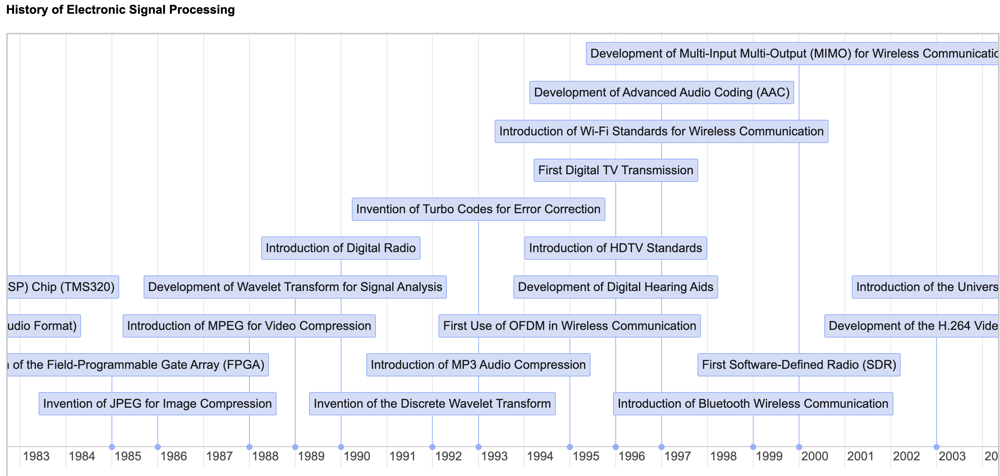

# Signal Processing Timeline

[Run the Timeline Event Viewer MicroSim](timeline-viewer.html){ .md-button .md-button--primary }

[View Events in vis.js events JSON Format](./events.json)

## References

* [Vis.js Timeline Docs](https://visjs.github.io/vis-timeline/docs/timeline/)
* [Timeline Prompt](../../prompts/08-timeline.md)
* [ChatGPT Dialog History](https://chatgpt.com/share/67828487-b05c-8001-8cd4-ce213d76b24e)