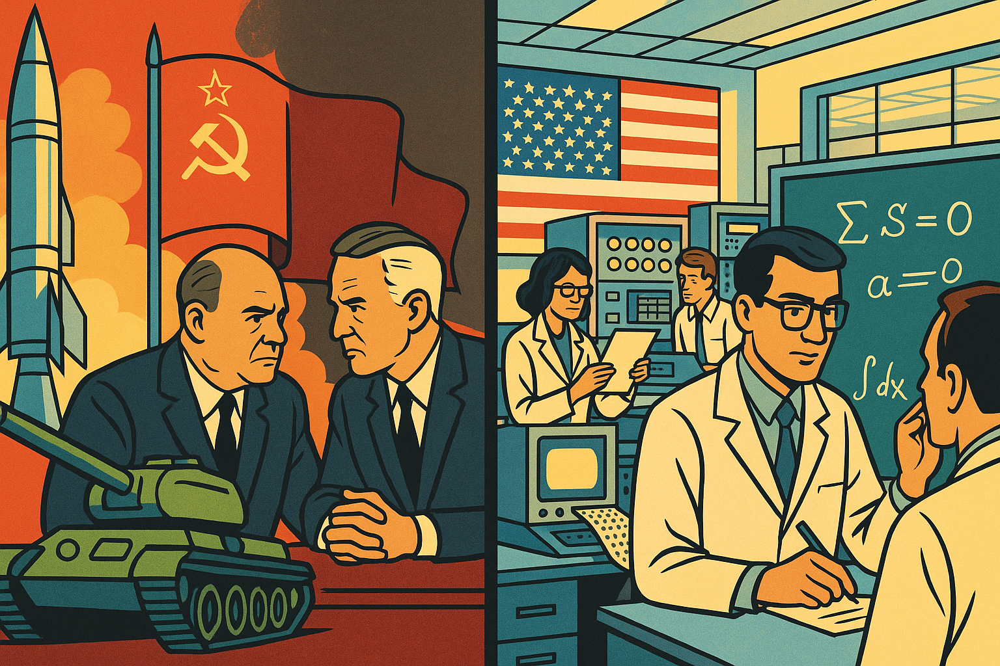
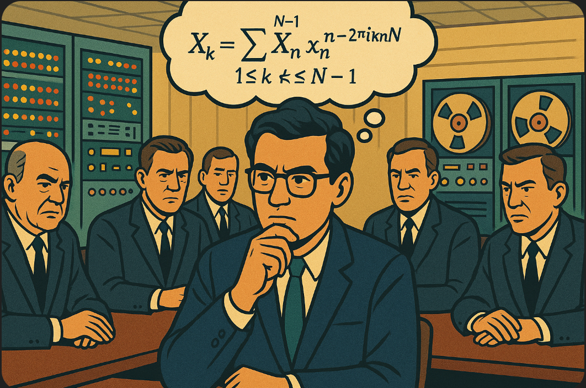
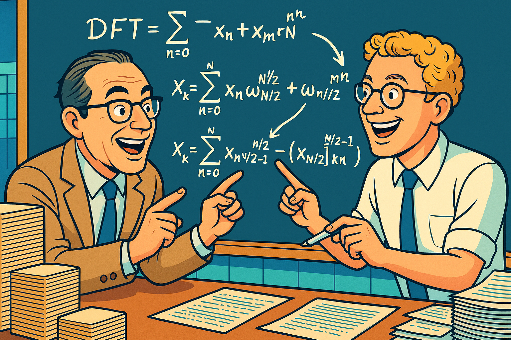
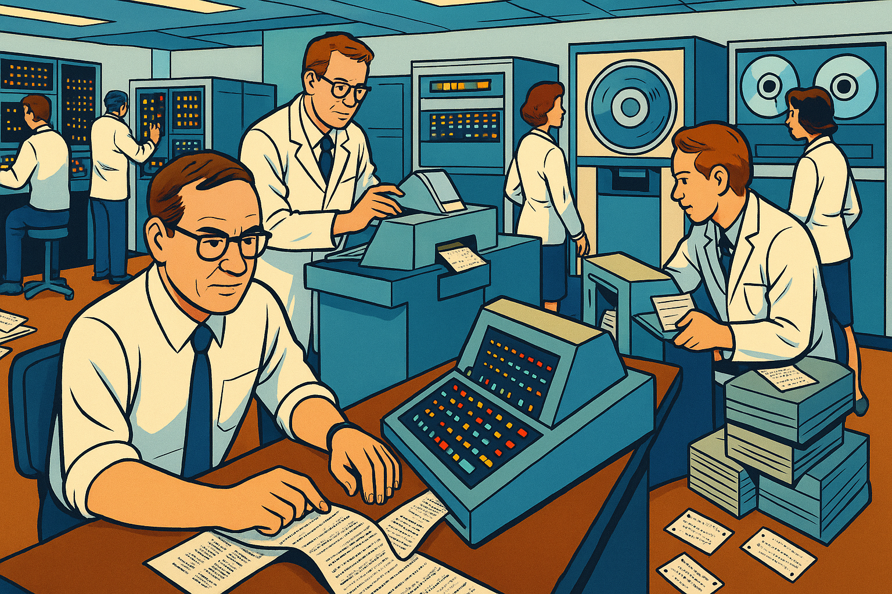
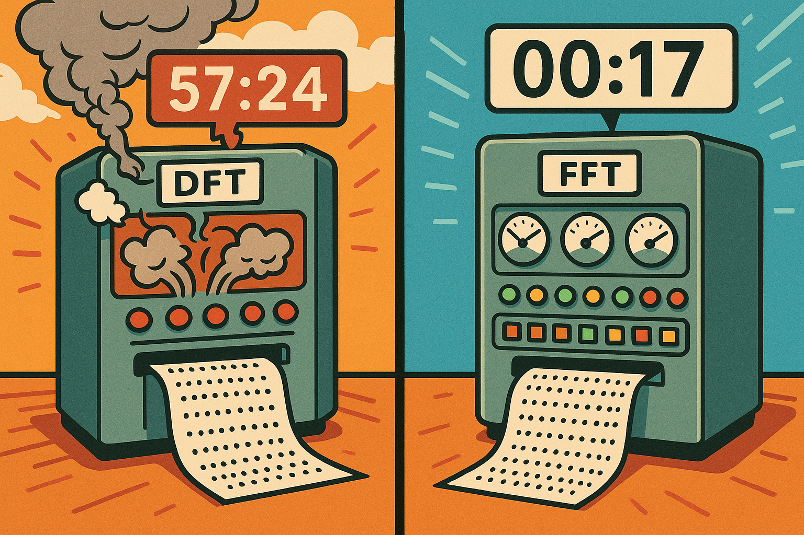
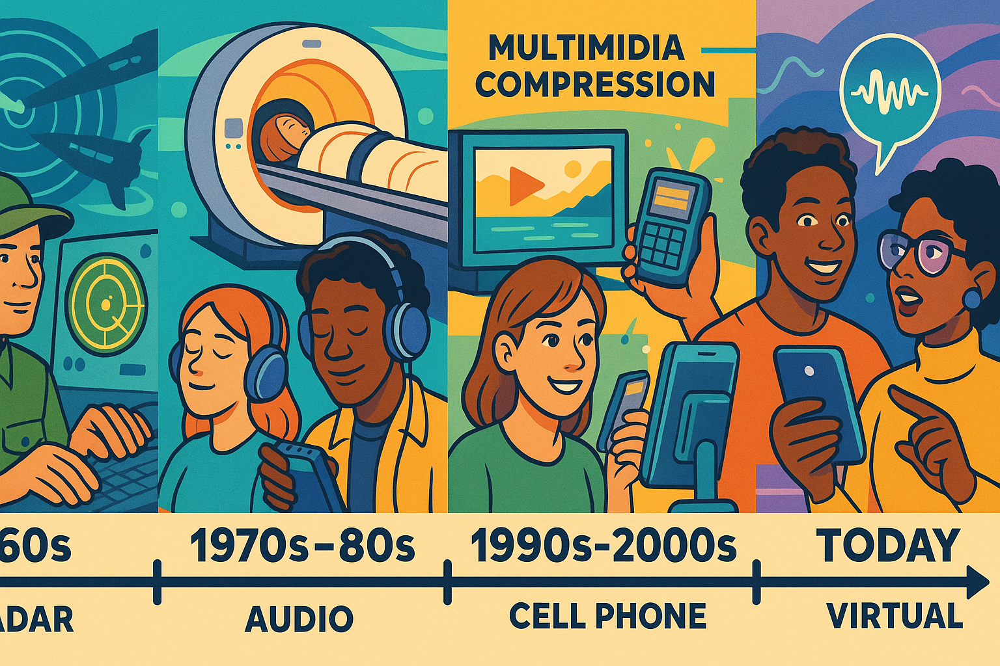

# Algorithm of the Century: Cooley and Tukey's FFT Revolution

   
Show Narrative Prompt

Please generate a full story narrative for me?  It should be a detailed, fun and entertaining story about the creation of the FFT and its relevance to the entire field digital signal processing. 

First put in some context.  Describe was happening in the world at the time they created the FFT.  Describe the challenges at the time and how they cleverly used efficient algorithms to solve the problem.

Describe the challenges the team faced and how they overcame these challenges.

Then talk about the short term implications of this tool.  Talk about how the efficiency of the FFT allowed new problems to be solved.

Then talk about the long-term impacts to the entire field of digital signal processing.  What types of new problems could be solved with the FFT?

Finally, generalize about the skills needed to be a great engineer and promote change.

Our goal is to have you generate the full text of the story, but to turn the story into a graphic novel with many illustrations that explain how the FFT algorithms was created. 

When appropriate, suggest an wide-landscape drawing that could be inserted into the narrative to make the story a graphic novel. 
Describe each image in detail and be consistent across all the images in the story for style. When you describe an image, make sure to mention that it should be a colorful, bright wide-landscape drawing suitable for consistent technology-forward optimistic graphic-novel.

   
Show Image Prompt

Cover Image:
Please create a new wide-landscape drawing using the style the bright, optimistic style of the graphic novel.
This should be the cover page for the the following story:

Algorithm of the Century: Cooley and Tukey's FFT Revolution" tells the story of how James Cooley and John Tukey revolutionized signal processing by developing the Fast Fourier Transform algorithm in 1965 during the Cold War. Born from the practical need to detect Soviet nuclear tests, their breakthrough reduced calculation time from N² to N log N operations, making previously impossible computations feasible on 1960s computers. The algorithm spread rapidly across scientific disciplines after being published, enabling real-time signal analysis for applications ranging from seismology to astronomy. The FFT ultimately transformed entire industries—creating the foundation for digital signal processing, enabling technologies like MRI machines, digital audio, telecommunications, and countless other innovations that shape our modern digital world. Their story illustrates how elegant mathematical solutions to efficiency problems can have far greater impact than raw computing power alone.

### CHAPTER 1: THE WORLD IN FLUX

Show Image Prompt

Image 1:
Please generate A wide-landscape drawing showing a split scene - on one side, the tense Cold War political environment with Soviet and American flags, military technology, and world leaders in serious discussion; on the other side, scientists and mathematicians at work in laboratories with early computers. The image should be rendered in a colorful, bright style with clean lines typical of an optimistic technology-focused graphic novel.

The year was 1965, and the world was in the grip of the Cold War. The United States and the Soviet Union were locked in a tense standoff, each racing to develop new technologies that could provide a crucial advantage. Nuclear testing had become a primary concern. When the Soviets tested nuclear weapons, the Americans needed to know—but how could they detect explosions happening thousands of miles away, behind the Iron Curtain?

At Princeton University, mathematician John Tukey was attending a meeting of President Kennedy's Science Advisory Committee. The discussion turned to a critical problem: developing a network of seismic sensors around the Soviet Union to detect nuclear tests. The data from these sensors would need rapid analysis—a problem that required processing enormous amounts of signal data with the limited computing power of the day.

Tukey, a brilliant mathematician with a knack for practical solutions, recognized that the traditional approach to analyzing frequency components in signals—the Discrete Fourier Transform (DFT)—was simply too slow. The standard method required N² calculations for N data points, making real-time analysis impossible with the computers available.

"There has to be a faster way," Tukey thought to himself as he jotted notes on a pad. The problem wasn't just theoretical—it had real-world implications for national security.

Show Image Prompt

IMAGE 2: Please create a new drawing.  It is detailed wide-landscape panel showing John Tukey deep in thought at a meeting table, surrounded by government officials in suits. Above his head, mathematical equations float in thought bubbles, suggesting his realization about a more efficient algorithm. In the background, early computer systems with blinking lights and spinning tape reels. The drawing should maintain the colorful, optimistic technology-forward style of the graphic novel.

### CHAPTER 2: THE SPARK OF INSIGHT

A few days after the meeting, Tukey shared his insight with Richard Garwin, a physicist who worked at IBM. Garwin immediately recognized the importance of Tukey's idea, not just for monitoring Soviet tests but for his own research on 3D crystals of Helium-3. Garwin introduced Tukey to James Cooley, a talented mathematician and programmer at IBM's Watson Research Center.

"I think we can reduce the number of calculations from N² to N log N," Tukey explained to Cooley. "It's all about breaking down the problem into smaller pieces."

Cooley was intrigued. He had been working on computational algorithms for years and understood the limitations of contemporary computers. Together, they began exploring Tukey's idea, which involved recursively breaking down a large DFT into smaller, more manageable ones.

Show Image Prompt

IMAGE 3: 
Please create a new wide-landscape drawing.
A colorful wide-landscape illustration showing Cooley and Tukey at a blackboard filled with equations, working together with energy and excitement. The blackboard should show the recursive decomposition of the DFT formula, with arrows indicating how it breaks into smaller parts. Around them, stacks of punch cards and printouts symbolize the computational limitations they were working against. The illustration should have a bright, optimistic technology-forward style.

For weeks, Cooley worked on implementing the algorithm, meticulously working through the mathematics and translating it into code that would run on IBM's computers. The challenge wasn't just theoretical—it was practical. How could they reorganize the calculations to minimize redundant operations? How could they leverage the limited memory of 1960s computers efficiently?

The breakthrough came when they realized they could use a "divide and conquer" approach. By splitting a transform of size N into two transforms of size N/2, then splitting those further, they could dramatically reduce the computational load. The trick was in how the results from these smaller transforms were combined.

"It's beautiful," Cooley remarked one evening, looking at the recursive pattern they had discovered. "We're not just making it faster—we're revealing the mathematical structure that was hidden all along."

### CHAPTER 3: THE IMPLEMENTATION

Show Image Prompt

IMAGE 4: 
Please create a new wide-landscape drawing.
A wide-landscape scene depicting the computing environment of the 1960s: large mainframe computers filling entire rooms, with operators in white lab coats monitoring blinking console lights, paper tape output, and punch cards being fed into readers. Cooley is shown implementing the algorithm on these systems. The illustration should maintain the bright, colorful style of a technology-forward graphic novel, presenting vintage technology with an optimistic lens.

Implementing the algorithm presented its own challenges. Computers in 1965 were a far cry from today's powerful machines. IBM's mainframes filled entire rooms, ran hot, and had severely limited memory. Every operation had to be carefully planned to fit within these constraints.

Cooley spent hours optimizing the algorithm, finding clever ways to reuse memory and minimize computational steps. The algorithm required a technique called "bit-reversal" to reorder data properly—something that added complexity but was essential for the method to work.

"We're not just saving time," Cooley explained to his colleagues. "We're making previously impossible calculations possible."

For a data set of 8,192 points, the standard DFT would require over 67 million operations. With their Fast Fourier Transform (FFT), the same calculation could be done with just about 106,000 operations—a speedup of more than 600 times. Problems that would have taken weeks could now be solved in minutes.

Show Image Prompt

IMAGE 5: 
Please create a new wide-landscape drawing.
A colorful wide-landscape illustration showing a split screen with two computers side by side - one running the traditional DFT algorithm (shown struggling with smoke coming from its circuits, dials in the red zone) and the other running the new FFT algorithm (shown processing data effortlessly with happy indicator lights). Above each machine, stylized time counters show the dramatic difference in processing time. The drawing should maintain the bright, optimistic technology-forward style.

### CHAPTER 4: PUBLICATION AND IMMEDIATE IMPACT

In April 1965, Cooley and Tukey published "An Algorithm for the Machine Calculation of Complex Fourier Series" in the journal Mathematics of Computation. In just six months, they had gone from initial idea to published paper—lightning speed in the academic world of the 1960s.

The publication ignited immediate interest. Scientists and engineers quickly recognized the revolutionary nature of what became known as the Cooley-Tukey FFT algorithm. It wasn't patented—IBM determined that since Tukey wasn't an IBM employee, the algorithm would go directly into the public domain.

This decision, perhaps unintentional, was crucial to the algorithm's rapid adoption. Scientists everywhere began implementing the FFT in their work, and the results were transformative.

Show Image Prompt

IMAGE 6: 
Please create a new wide-landscape drawing.
A wide-landscape drawing showing the ripple effect of the FFT publication. The center shows the journal with the paper, and expanding outward are various scientists and engineers in different fields (acoustics, radio astronomy, medical imaging, etc.) implementing and using the algorithm. Each application should be visually distinguished by color and imagery related to its field. The illustration should use bright colors and clean lines in an optimistic technology-forward style.

Seismologists could now process earthquake data in real-time. Radio astronomers could analyze signals from space with unprecedented precision. Sound engineers could visualize audio frequencies instantly. And yes, the original application—detecting Soviet nuclear tests—became feasible with the network of sensors placed around the USSR.

What many didn't realize at first was that Cooley and Tukey had rediscovered a method originally developed by Carl Friedrich Gauss around 1805. Gauss had used a similar approach to calculate the trajectories of asteroids, but his work, published posthumously in Latin, had been largely forgotten until it was connected to the FFT years after Cooley and Tukey's publication.

### CHAPTER 5: TRANSFORMING DIGITAL SIGNAL PROCESSING

Show Image Prompt

IMAGE 7: 
Please create a new wide-landscape drawing.
A colorful wide-landscape illustration showing the evolution of signal processing applications through the decades following the FFT. The timeline should flow from left to right, starting with 1960s applications (radar, sonar), through 1970s-80s (medical imaging, audio equipment), 1990s-2000s (multimedia compression, cell phones), to modern applications (AI voice recognition, virtual reality). Each era should have distinctive technology and fashion elements while maintaining the bright, optimistic style of the graphic novel.

Within a decade, the FFT had become the cornerstone of an entirely new field: digital signal processing (DSP). Before the FFT, most signal processing was done with analog circuits—physical electronic components that had to be designed and built for specific applications. The FFT made it practical to process signals digitally, enabling flexibility and capabilities that were previously unimaginable.

The impact spread across industries:

In telecommunications, the FFT enabled more efficient modulation techniques, leading to higher data rates over the same bandwidth. Modern cellular networks and Wi-Fi would be impossible without FFT-based modulation schemes like OFDM (Orthogonal Frequency Division Multiplexing).

In medicine, the FFT became central to image reconstruction in CT scanners and MRI machines, allowing doctors to see inside the human body non-invasively and with remarkable detail.

In audio processing, the FFT revolutionized how we analyze, manipulate, and compress sound. Every MP3 file, digital music production tool, and voice recognition system relies on FFT-based techniques.

Show Image Prompt

IMAGE 8: 
Please create a new wide-landscape drawing.
A detailed wide-landscape drawing showing multiple panels of FFT applications in everyday life - someone listening to compressed music on headphones, a patient in an MRI machine, people using smartphones, voice assistants responding to commands, and radar systems monitoring weather. The illustration should use bright colors and clean lines typical of an optimistic technology-focused graphic novel.

In astronomy, the FFT enabled radio telescopes to process vast amounts of data, helping scientists detect pulsars, map distant galaxies, and even search for extraterrestrial intelligence.

In weather forecasting, the FFT helped process radar data and implement the complex mathematical models that predict tomorrow's weather.

Perhaps most surprising was how the FFT transformed fields that weren't even on the radar when Cooley and Tukey developed their algorithm—like digital photography, where FFT-based algorithms are used for image compression and enhancement.

### CHAPTER 6: THE MODERN ERA AND LEGACY

Show Image Prompt

IMAGE 9: 
Please create a new wide-landscape drawing.
A bright, colorful wide-landscape illustration showing modern applications of FFT in cutting-edge technology. The scene should depict autonomous vehicles using radar and lidar, smartphones with voice assistants, virtual reality headsets, medical imaging devices, and AI systems - all with subtle indications of FFT operations powering them. The illustration should maintain the optimistic technology-forward style with clean lines and vibrant colors.

Today, FFT algorithms run billions of times per second on devices we carry in our pockets. Modern implementations have been optimized to run efficiently on everything from tiny microcontrollers to massive supercomputers and specialized signal processing chips.

The FFT has become so ubiquitous that most engineers take it for granted—it's built into software libraries, hardware accelerators, and development tools. But its importance cannot be overstated. Without the FFT, many of the digital technologies we rely on daily would be impractically slow or impossible.

In a world increasingly driven by digital data, the ability to efficiently analyze signals—whether they're radio waves, sound, light, or more abstract data—is fundamental to technological progress. The FFT makes this possible.

### CHAPTER 7: LESSONS FOR FUTURE INNOVATORS

Show Image Prompt

IMAGE 10: 
Please create a new wide-landscape drawing.
A wide-landscape drawing showing young, diverse students and engineers studying and working with signal processing technologies. One half should show them learning about FFT in a classroom or lab setting; the other half should show them applying this knowledge to new innovations. The background should include mathematical equations and signal visualizations. The illustration should use the same bright, colorful, optimistic technology-forward style as previous images.

The story of Cooley and Tukey's FFT offers several lessons for aspiring engineers and mathematicians:

First, breakthrough innovations often come from looking at old problems in new ways. The mathematical foundation of the Fourier transform had existed for 150 years before Cooley and Tukey found a way to compute it efficiently.

Second, some of the most important advances happen at the intersection of theory and practice. The FFT wasn't just an elegant mathematical discovery—it was an algorithm designed to run efficiently on real computers with practical limitations.

Third, understanding fundamentals can lead to widely applicable solutions. Cooley and Tukey were solving a specific problem—detecting nuclear tests—but their solution proved valuable across countless fields.

Fourth, collaboration across disciplines can spark innovation. Tukey's mathematical insight combined with Cooley's programming expertise created something neither might have achieved alone.

Finally, the most revolutionary innovations often don't appear revolutionary at first. The FFT was, at its core, a more efficient way to calculate something mathematicians already knew how to calculate. Yet this efficiency unlocked entirely new possibilities, transforming entire industries and enabling new technologies.

Show Image Prompt

IMAGE 11: 
Please create a new wide-landscape drawing.
A colorful wide-landscape drawing showing Cooley and Tukey in the foreground, looking at the modern world their algorithm helped create. Behind them should be a montage of technologies that rely on FFT - digital communication, medical imaging, space exploration, music production, and more. The style should remain consistent with previous illustrations - bright, optimistic, and technology-forward.

The FFT revolution teaches us that elegant algorithms and efficient code aren't just academic exercises—they're how we overcome the limitations of hardware and make the impossible possible. In our world of limited computational resources and growing data, algorithmic efficiency remains as important today as it was in 1965.

As we face new challenges in computing, artificial intelligence, climate modeling, and other fields, we need the same kind of innovative thinking that Cooley and Tukey demonstrated—the ability to find elegant, efficient solutions to complex problems.

Their algorithm reminds us that sometimes, the most powerful tool isn't more computing power, but a smarter algorithm. An algorithm so powerful it can transform our understanding of the world—one frequency at a time.

### THE END

## References

    
References Prompt

    Please generate ten engaging references for this story behind
    the creation of the FFT algorithm.
    The references should be fun and engaging articles from reputable sources that an advanced high-school senior can
    understand.  Return the references in the following format:

    1. [Link Label](Link URL) - date of publication - publication name - notes on why this article might be interesting.

Here are ten engaging references about the Fast Fourier Transform that high school students would enjoy:

- [The FFT is Fifty](https://californiaconsultants.org/the-fft-is-fifty/) - 2015 - California Consultants - A readable celebration of the FFT's 50th anniversary that explains its significance in non-technical terms and its revolutionary impact on technology.

- [How the Cooley-Tukey FFT Algorithm Works](https://www.dsprelated.com/showarticle/1709.php) - 2019 - DSP Related - An excellent multi-part tutorial that breaks down the algorithm step-by-step with clear explanations suitable for high school students with basic math knowledge.

- [A Faster Fast Fourier Transform](https://spectrum.ieee.org/a-faster-fast-fourier-transform) - 2012 - IEEE Spectrum - Covers modern developments in FFT algorithms and explains why the original breakthrough remains so important in digital signal processing.

- [Fast Fourier Transform on Wikipedia](https://en.wikipedia.org/wiki/Fast_Fourier_transform) - Updated 2025 - Wikipedia - A comprehensive reference with history, applications, and technical details that ambitious students can explore at their own pace.

- [The Scientist and Engineer's Guide to Digital Signal Processing](https://www.dspguide.com/ch12.htm) - Free online book - A completely free online textbook with an excellent chapter on the FFT that includes clear diagrams and practical examples.

- [Understanding the Cooley-Tukey FFT](https://vanhunteradams.com/FFT/FFT.html) - Educational resource - Features step-by-step explanations with mathematical derivations that are accessible to students with high school calculus knowledge.

- [50 Years of FFT Algorithms and Applications](https://www.researchgate.net/publication/333029661_50_Years_of_FFT_Algorithms_and_Applications) - 2019 - Researchgate - A historical overview that traces the development and applications of FFT, with the full article available for download.

- [Fast Fourier Transforms - Interactive Mathematics](http://www.intmath.com/fourier-series/11-fast-fourier-transform-fft.php) - Interactive Mathematics - Features interactive examples that let students see how the FFT works in practice, with visual demonstrations.

- [FFT Demo on GitHub](https://github.com/bubnicbf/Fast-Fourier-Transform-using-Cooley-Tukey-algorithm) - GitHub - Provides actual working code examples of the FFT algorithm that programming-oriented students can experiment with directly.

- [The Cooley-Tukey FFT and Modern Computing](https://www.mathworks.com/help/signal/ug/fast-fourier-transform-fft.html) - MathWorks - Shows how the FFT is used in modern software like MATLAB, with examples of practical applications in signal processing.

These resources cover different aspects of the FFT, from its historical development to practical applications, and are presented at various levels of technical detail to accommodate different student interests and abilities.