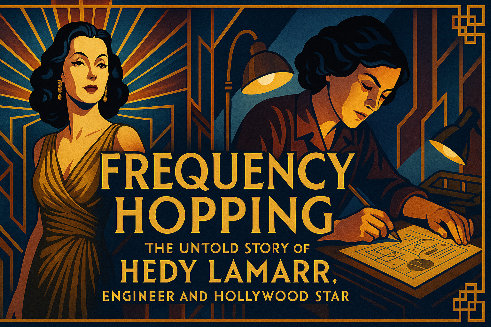
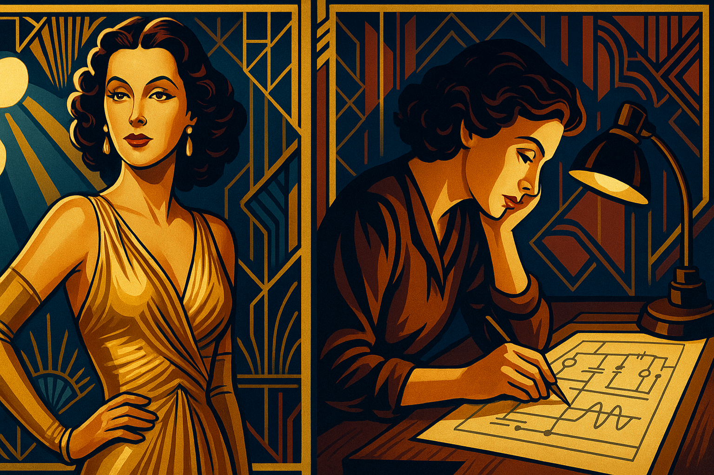
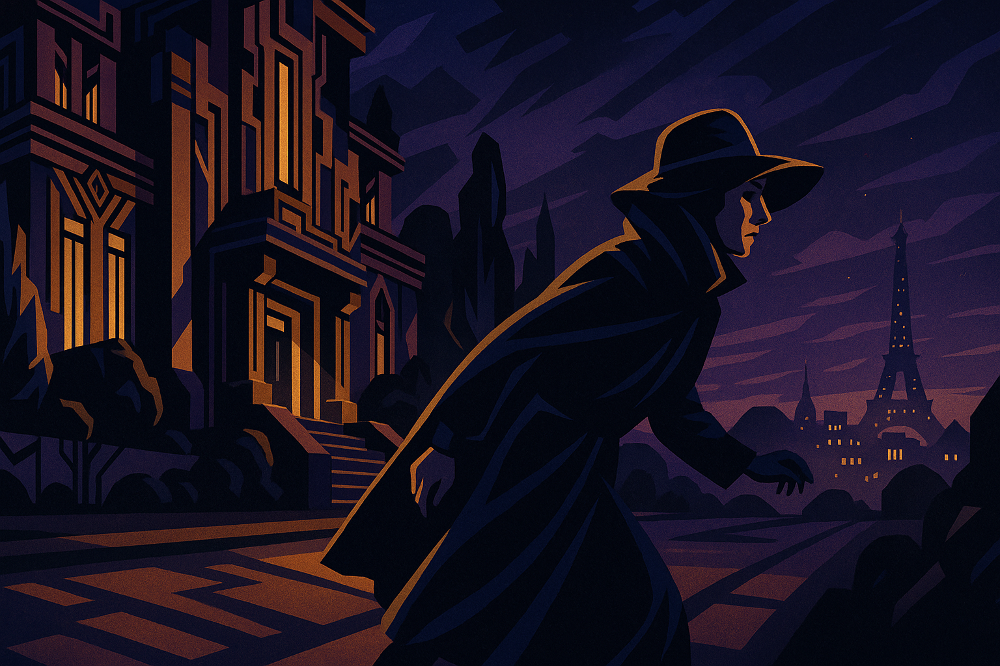
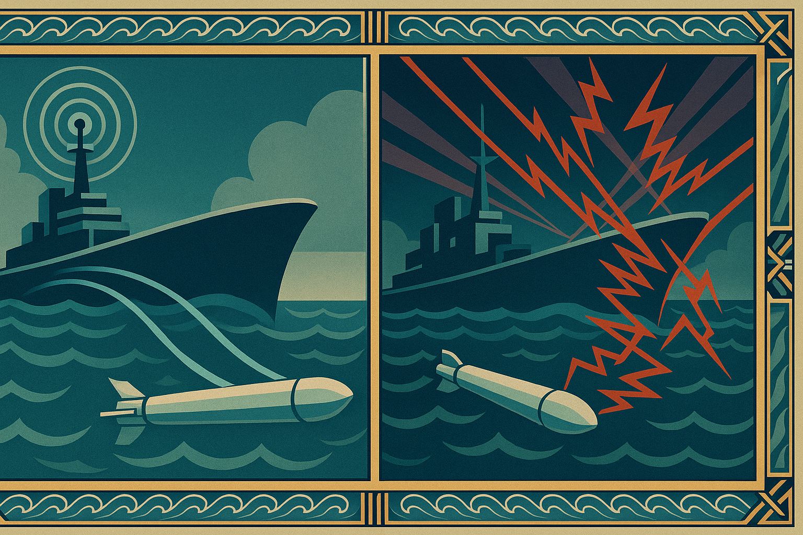
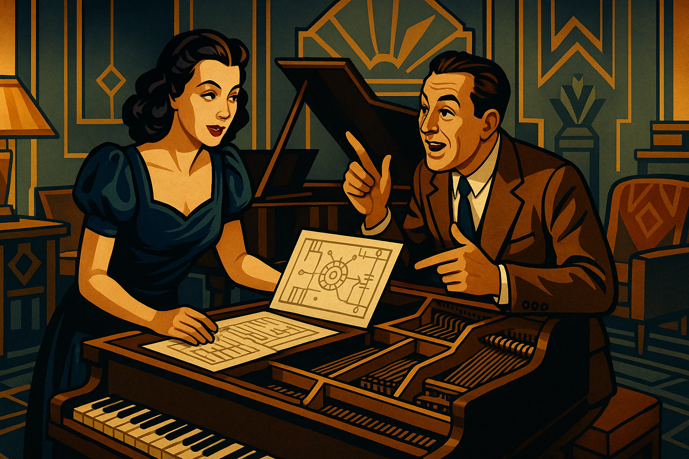
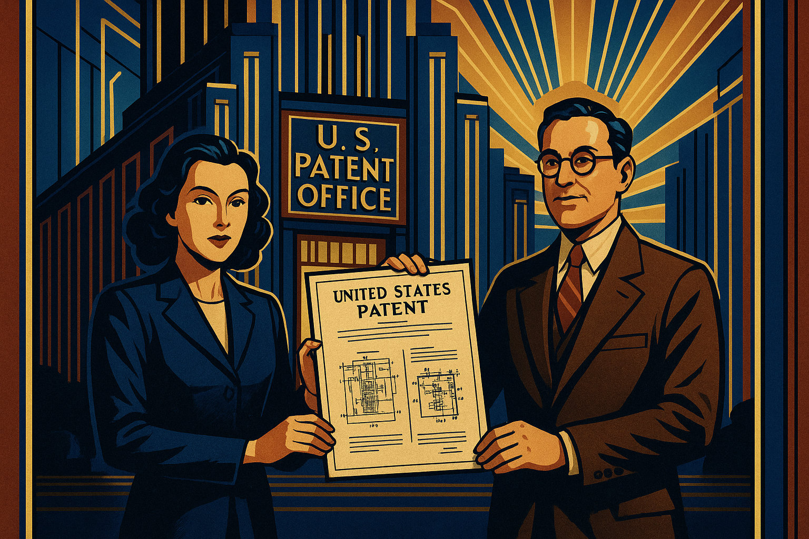
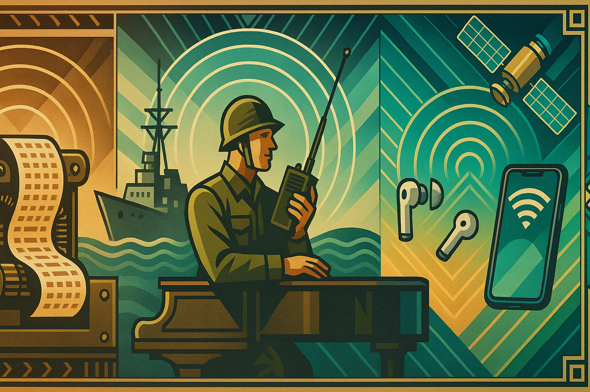
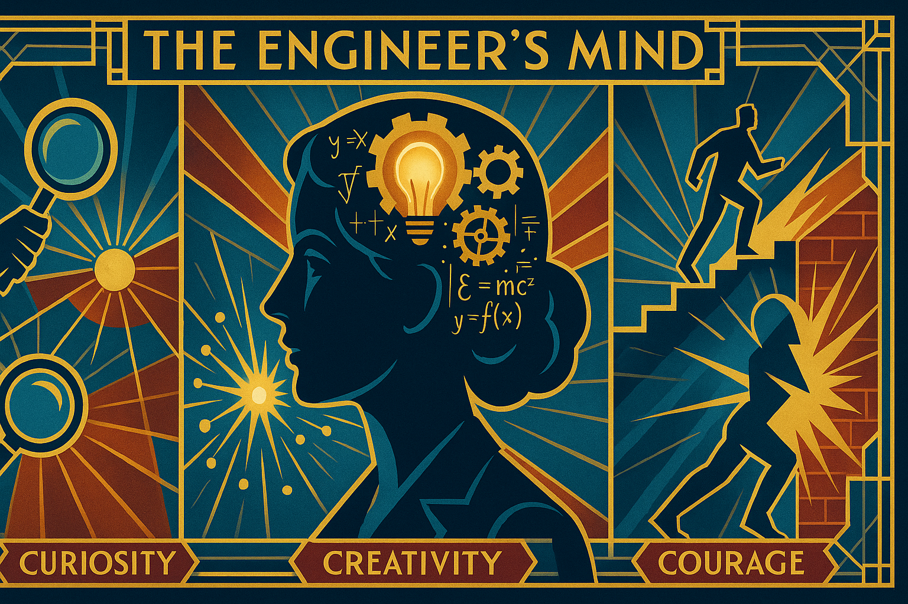

# Frequency Hopping: The Untold Story of Hedy Lamarr, Engineer and Hollywood Star

   
Show Image Prompt

   Please generate a new wide-landscape art deco inspired illustration as it might appear in a graphic novel. 

   The illustration is a the cover artwork for this graphic novel: Frequency Hopping: The Untold Story of Hedy Lamarr, Engineer and Hollywood Star

## Introduction

   
Show Image Prompt

I would like to create new graphic novel based around the story of Hedy Lamarr and her work on signal processing.

The story should have about a dozen panels of graphic-novel type drawings.  Please use an art deco style drawings that were popular around 1942.  The drawing should all be a wide-landscape format. 

Your job is to write the overall narrative of the story and then describe in details the images in each story.

You are welcome to use the heady-lamarr-story-v1.md to get started.
The story should show Heady Lamarr in a positive superhero-like role and her ability to overcome adversity despite being a woman.

Finally, generalize about the skills needed to be a great engineer and promote change. Our goal is to have you generate the full text of the story, but to turn the story into a graphic novel with many illustrations that explain how the Hedy invited the ideas of frequency shifting. 

When appropriate, suggest an wide-landscape drawing that could be inserted into the narrative to make the story a graphic novel. Describe each image in detail and be consistent across all the images in the story for style. 

When you describe an image, make sure to mention that it should be a colorful, bright wide-landscape drawing with an art deco design style.

In the glittering world of 1940s Hollywood, one woman led a double life. By day, she was Hedy Lamarr, the glamorous movie star whose beauty captivated audiences worldwide. By night, she was an ingenious inventor whose brilliant mind would change the course of technology forever.

   
Show Image Prompt

   Please generate a new wide-landscape art deco illustration as it might appear in a graphic novel.

   Image 1: A wide-landscape, colorful art deco illustration showing Hedy Lamarr in a dramatic split-screen composition. On the left side, she appears as a glamorous 1940s Hollywood star under bright studio lights, wearing an elegant gown. On the right side, she's hunched over a workbench with engineering diagrams, wearing comfortable clothes, her face illuminated by a single lamp. The background should feature bold geometric art deco patterns in gold, deep blue, and burgundy. The composition should emphasize the duality of her existence through strong contrasting colors while maintaining art deco's characteristic bold lines and symmetry.

## The Escape

Born Hedwig Eva Maria Kiesler in Vienna, Austria, Hedy's journey began long before Hollywood discovered her. In 1933, she starred in the controversial Czech film "Ecstasy," gaining international attention. Her beauty caught the eye of Friedrich Mandl, a wealthy Austrian munitions manufacturer with ties to the fascist regimes rising across Europe.

   
Show Image Prompt

Please generate a new wide-landscape art deco illustration as it might appear in a graphic novel.

Image  2: A wide-landscape, colorful art deco illustration depicting Hedy's escape from her controlling husband. The image should show Hedy in disguise, sneaking away from a mansion at night. The mansion should have strong architectural art deco elements with sharp angles and geometric patterns. Use dramatic lighting with long shadows and a palette of deep purples, midnight blues, and golden highlights. In the distance, show the lights of Paris beckoning. The composition should convey tension and determination, with Hedy's figure small but resolute against the imposing background.

Their marriage was a prison. Mandl was possessive and controlling, parading Hedy at business meetings with military officials and Nazi industrialists. But Hedy was no passive observer. With a mind sharp as a razor, she absorbed complex technical discussions about weapons systems and military communications. Little did anyone suspect that the beautiful woman they dismissed as mere decoration was memorizing their military secrets.

In 1937, Hedy orchestrated a daring escape. Disguising herself as a maid, she fled to Paris, then London, and finally to America, where a contract with MGM Studios awaited.

## The Hollywood Star

By 1940, Hedy Lamarr was one of Hollywood's brightest stars. Her exotic beauty and enigmatic presence captivated audiences in films like "Algiers," "Boom Town," and "Comrade X." The press dubbed her "the most beautiful woman in the world."

   
Show Image Prompt

Please generate a new wide-landscape art deco inspired illustration as it might appear in a graphic novel.

Image  3: A wide-landscape, colorful art deco illustration showing Hedy on a movie set. The scene should be vibrant with studio lights creating dramatic shadows. Hedy should be in costume for a film, standing confidently at the center while directors, cameramen and other actors orbit around her. The composition should use typical art deco styling with strong geometric patterns, stepped forms, and sunburst motifs in the background. Use a color palette of rich golds, deep greens, and bright whites to capture the glamour of Golden Age Hollywood. The perspective should be slightly elevated to show the bustling activity of the whole set.

Yet behind the glamour, Hedy's brilliant mind remained restless. The world was at war, and she could not stand idly by while her adopted country fought against the very regimes she had fled. Her technical knowledge, gleaned from dinner conversations with Mandl and his associates, combined with her natural gift for invention, was about to change the course of history.

## The Problem of Guided Torpedoes

In 1940, as the Battle of the Atlantic raged, Allied ships were being sunk at an alarming rate by German U-boats. Radio-controlled torpedoes offered a potential advantage, but there was a critical flaw: the radio signals could be easily jammed by the enemy.

   
Show Image Prompt

Please generate a new wide-landscape art deco inspired illustration as it might appear in a graphic novel.

Image  4: A wide-landscape, colorful art deco illustration depicting the problem of radio jamming. The image should be split into two scenes - on the left, show a diagram of how radio-controlled torpedoes were supposed to work, with clean signal lines connecting a ship to a torpedo. On the right, show the reality with signal interference represented by jagged red lines disrupting the connection. Use a nautical color palette of blues and greens for the ocean, with bold red for the jamming signals. The entire composition should be framed with art deco borders featuring wave patterns and geometric naval motifs. The style should be somewhat technical but still artistic, combining diagrams with the decorative art deco aesthetic.

Hedy understood the problem immediately. If the torpedo and its control system remained on a single frequency, that frequency could be found and jammed. But what if the frequency changed constantly, and in a pattern known only to the sender and receiver?

Late at night, after shooting wrapped on her latest film, Hedy would return home and work on her idea. The concept was revolutionary: a frequency-hopping system that would make signals nearly impossible to jam or intercept.

## The Partnership with George Antheil

At a dinner party in Hollywood, Hedy met George Antheil, an avant-garde composer known for his Ballet Mécanique, a piece written for sixteen player pianos operating in sync. Their conversation quickly turned to the war effort, and Hedy shared her frequency-hopping concept.

   
Show Image Prompt

Please generate a new wide-landscape art deco inspired illustration as it might appear in a graphic novel.

Image  5: A wide-landscape, colorful art deco illustration showing Hedy and George Antheil collaborating. They should be depicted at an elegant piano in a stylish 1940s living room, with engineering diagrams and musical scores spread between them. The piano should be a central element, with its mechanical parts partially visible, suggesting the connection to their invention. The room should have characteristic art deco features - geometric patterns in the furniture, stepped forms in the architecture, and bold contrasting colors. Use a palette of warm ambers, deep blues, and metallic gold accents. Antheil should be gesturing excitedly while Hedy points to something in the diagrams, creating a sense of intellectual partnership and shared enthusiasm.

Antheil was immediately intrigued. His experience synchronizing player pianos was the perfect complement to Hedy's frequency-hopping concept. Together, they developed a system using paper rolls similar to those in player pianos to synchronize the frequency changes between the transmitter and receiver. This meant that even if enemies detected the signal, they would only hear a brief blip before it jumped to another frequency.

## The Mechanics of Frequency Hopping

Their invention was elegant in its simplicity. The system would use 88 frequencies (the same as the number of keys on a piano) and both the transmitter and receiver would have identical paper rolls dictating the precise timing of frequency changes.

   
Show Image Prompt

Please generate a new wide-landscape art deco inspired illustration as it might appear in a graphic novel.

Image  6: A wide-landscape, colorful art deco illustration explaining the frequency-hopping concept. This should be a visual diagram showing how the system works: on the left side, show a transmitter with a paper roll controlling frequency changes (similar to a player piano roll), with colorful waves emanating at different frequencies. In the center, show these waves traveling through space, constantly changing colors to represent different frequencies. On the right, show a receiver with an identical paper roll synchronized to receive each frequency at the exact right moment. The entire composition should be styled with bold art deco geometric patterns, using a vibrant color palette where each frequency is represented by a different color. The diagram should be educational but still artistic and visually striking, with the characteristic symmetry and bold lines of art deco design.

The system was ingenious. Even if the enemy managed to jam one frequency, the signal would have already moved to another by the time they adjusted their jamming equipment. It was not only a secure communication system but also an early form of what we now call spread spectrum technology.

## The Patent and Rejection

On August 11, 1942, U.S. Patent No. 2,292,387 was granted to Hedy Kiesler Markey (her married name at the time) and George Antheil for their "Secret Communication System." It was a remarkable achievement for anyone, let alone a Hollywood actress and a composer.

   
Show Image Prompt

Please generate a new wide-landscape art deco inspired illustration as it might appear in a graphic novel.

Image  7: A wide-landscape, colorful art deco illustration showing Hedy and George proudly holding their patent document in front of the U.S. Patent Office. The building should have grand art deco architecture with strong vertical lines and geometric ornamentation. Hedy should be dressed in a smart 1940s suit rather than glamorous attire, emphasizing her role as an inventor. The patent document should be visible with technical diagrams. Use a patriotic color palette of deep blues, rich reds, and metallic golds, with dramatic lighting that creates long shadows typical of art deco illustration style. The composition should convey a sense of accomplishment and historical significance.

However, when they presented their invention to the U.S. Navy, they were met with dismissal. The military establishment could not take seriously the idea that a beautiful actress and an avant-garde composer could contribute anything of value to the war effort. Instead, they suggested that Hedy use her celebrity to sell war bonds.

## The War Effort

Though disappointed by the rejection, Hedy was determined to help defeat fascism. She threw herself into selling war bonds, using her star power to raise millions of dollars for the Allied cause.

   
Show Image Prompt

Please generate a new wide-landscape art deco inspired illustration as it might appear in a graphic novel.

Image  8: A wide-landscape, colorful art deco illustration showing Hedy at a war bond rally. She should be depicted on a stage with patriotic art deco-style banners and decorations, addressing a large crowd. The scene should be dynamic, with Hedy as the radiant focal point in a glamorous outfit, gesturing powerfully as she speaks. The crowd should show diverse Americans responding enthusiastically. Use a bold color scheme of reds, whites, and blues with gold accents, and incorporate patriotic symbols stylized in art deco fashion. The composition should capture both Hedy's star power and her passionate commitment to the war effort, with dramatic lighting creating a heroic atmosphere.

"I'm not ashamed of having sold kisses for $25,000 apiece at war bond rallies," she once said. "It helped destroy Hitler." All the while, she never stopped believing in her invention, even as the world continued to see her only for her beauty.

## Decades Ahead of Her Time

For years, Hedy's invention gathered dust, forgotten by the military establishment. It wasn't until the Cuban Missile Crisis in 1962 that the U.S. military finally began using frequency-hopping technology on naval ships.

   
Show Image Prompt

Please generate a new wide-landscape art deco inspired illustration as it might appear in a graphic novel.

Image  9: A wide-landscape, colorful art deco illustration depicting the technological evolution of Hedy's invention. This should be a montage-style image showing the progression of frequency-hopping technology from the 1940s to modern day. On the left, show the original concept with mechanical components in a 1940s aesthetic. In the center, show military applications from the 1960s. On the right, show modern devices using WiFi, Bluetooth, and GPS. Use a progressive color scheme that transitions from the sepia tones of the past to vibrant modern colors, while maintaining art deco styling throughout with geometric patterns, symmetry, and decorative elements. The composition should communicate the forward-thinking nature of Hedy's invention and its lasting impact.

By then, Hedy and George's patent had expired, and they never received a penny for their groundbreaking work. The technology they pioneered would eventually become the foundation for secure military communications, GPS, Bluetooth, and Wi-Fi—technologies that billions of people use every day.

## Recognition at Last

It wasn't until 1997, when Hedy was 82 years old, that she finally received recognition for her technological contributions. The Electronic Frontier Foundation presented her with their Pioneer Award, acknowledging her role in developing spread spectrum technology.

   
Show Image Prompt

Please generate a new wide-landscape art deco inspired illustration as it might appear in a graphic novel.

Image  10: A wide-landscape, colorful art deco illustration showing an elderly Hedy receiving recognition for her invention. The scene should depict Hedy accepting an award on stage, with images of modern technology (cell phones, wireless devices) projected behind her. Despite her age, she should be portrayed with dignity and elegance, her expression showing vindication and quiet pride. The audience should be filled with modern technologists and engineers giving her a standing ovation. Use a sophisticated art deco color palette of deep purples, blues, and gold accents, with dramatic lighting highlighting Hedy as the central figure. The composition should convey the theme of long-delayed justice and recognition, with art deco styling in the stage design and decorative elements.

When a reporter asked how a beautiful movie star could also be an inventor, Hedy famously replied, "Films have a certain place in a certain time period. Technology is forever." And later: "Any girl can be glamorous. All you have to do is stand still and look stupid. But to be innovative—that's something else entirely."

## Legacy: The Engineer's Mind

Hedy Lamarr's story reveals the qualities that make a great engineer: curiosity, creativity, persistence, and the courage to challenge conventional thinking. She saw a problem that others overlooked and imagined a solution that was decades ahead of its time.

   
Show Image Prompt

Please generate a new wide-landscape art deco inspired illustration as it might appear in a graphic novel.

Image  11: A wide-landscape, colorful art deco illustration depicting "The Engineer's Mind." This should be a symbolic representation of the engineering process, with Hedy's silhouette as a central element containing gears, light bulbs, mathematical equations, and interconnected ideas. Around her should be representations of the qualities of great engineers - curiosity (magnifying glass), creativity (exploding ideas), persistence (climbing steps), and courage (breaking through barriers). Use bold art deco styling with strong geometric patterns and a vibrant color palette of blues, golds, and reds. The composition should be inspirational and educational, showing how these qualities combine to create innovation.

She did this without formal training, institutional support, or recognition—and in spite of a society that valued her only for her appearance. Her story reminds us that innovation can come from unexpected places and that brilliance knows no boundaries of gender, profession, or background.

## Conclusion: The Superhero We Need

Today, as we use our smartphones and wireless devices, we are all beneficiaries of Hedy Lamarr's brilliance. Her legacy lives on not just in the technologies she helped create, but in every girl and woman who dares to pursue science, technology, engineering, and mathematics despite being told that these are not fields for them.

   
Show Image Prompt

Please generate a new wide-landscape art deco inspired illustration as it might appear in a graphic novel.

Image  12: A wide-landscape, colorful art deco illustration showing Hedy's enduring legacy. The image should be split: on one side, show Hedy in the 1940s working on her invention; on the other side, show diverse modern young women working with technology, clearly inspired by her example. Between them should be visual representations of wireless signals connecting past to present. The entire composition should be framed with art deco styling using bold geometric patterns and vibrant colors. Use a triumphant color palette of bright blues, purples, and gold that suggests optimism and progress. The image should convey that Hedy's true superpower was her mind, and that her legacy continues through all who follow in her path.

Hedy Lamarr was more than a beautiful face on the silver screen. She was an engineer, an inventor, and a pioneer who helped shape our modern world. In many ways, she was the superhero we needed—not because she could fly or had superhuman strength, but because she had the courage to use her mind in a world that only wanted her to stand still and look beautiful.

Her story teaches us that change doesn't always come from those with the most credentials or the loudest voices. Sometimes, it comes from those who see a problem differently, who dare to imagine solutions that others cannot see, and who persist even when the world tells them they don't belong.

In the art deco era of the 1940s, Hedy Lamarr brought both glamour and genius to a world at war. Today, her legacy reminds us that the most powerful force for change is not beauty, fame, or even technology itself—it's the brilliant, unbounded human mind.

## References

   
References Prompt

   Please generate ten engaging references for the story Frequency Hopping: The Untold Story of Hedy Lamarr, Engineer and Hollywood Star the creation of the  frequency hopping. The references should be fun and engaging articles from reputable sources that an advanced high-school senior can understand. Return the references in the following format: 
   
   1. [Link Label](Link URL) - date of publication - publication name - notes on why this article might be interesting. 
   
   Make sure that the links are all real working links. Test that the links are all currently working.

1.  [Bombshell: The Hedy Lamarr Story](https://www.pbs.org/wnet/americanmasters/bombshell-hedy-lamarr-story-film/9906/) - January 2018 - PBS American Masters - This award-winning documentary explores Lamarr's dual life as a glamorous Hollywood star and brilliant inventor. Includes interviews with her children and rare audio recordings of Lamarr herself discussing her inventions.
2.  [How Hollywood Star Hedy Lamarr Invented the Tech Behind Wi-Fi](https://www.history.com/articles/hedy-lamarr-inventor-frequency-hopping-wifi) - February 2024 - HISTORY - A fascinating article explaining how Lamarr's "frequency hopping" concept evolved from a wartime innovation to becoming fundamental technology for modern wireless communications, with engaging anecdotes about her collaboration with composer George Antheil.
3.  [Hedy Lamarr: Mother of Wi-Fi](https://www.thalesgroup.com/en/worldwide/digital-identity-and-security/magazine/women-technology-hedy-lamarr-mother-wi-fi) - March 2023 - Thales Group - This article explores how Lamarr's innovative mind tackled both scientific challenges and Hollywood stereotypes, with helpful explanations of how her technology works in today's devices.
4.  [The Hollywood Bombshell Who Invented an Indispensable War Technology](https://www.smithsonianmag.com/travel/hedy-lamarr-brainy-bombshell-hollywood-actress-world-war-II-frequency-hopping-patent-cultural-travel-smithsonian-journeys-travel-quarterly-180958901/) - April 2016 - Smithsonian Magazine - A concise but insightful profile that captures how Lamarr's invention was initially dismissed by the Navy who told "the actress to stick to raising money for the war effort."
5.  [Random Paths to Frequency Hopping](https://www.americanscientist.org/article/random-paths-to-frequency-hopping) - February 2020 - American Scientist - This scholarly yet approachable article places Lamarr's invention in historical context, exploring the parallel development of similar technologies and offering a more nuanced view of technological innovation.
6.  [Hedy Lamarr and Frequency Hopping](https://cademuseum.org/podcast/hedy-lamarr-and-frequency-hopping/) - October 2019 - Cade Museum Podcast - A fascinating interview with Anthony Loder, Hedy Lamarr's son, who shares personal stories about his mother's inventive mind and her struggles for recognition.
7.  [Hedy Lamarr: From Hollywood Glamour to Frequency-Hopping](https://spie.org/news/photonics-focus/septoct-2021/hedy-lamarr-from-hollywood-glamour-to-frequency-hopping) - September 2021 - SPIE (International Society for Optics and Photonics) - This article includes interesting quotes from experts discussing the technical significance of Lamarr's invention and why it was initially dismissed.
8.  [Hedy Lamarr: Golden Age Film Star---and Important Inventor](https://www.si.edu/newsdesk/snapshot/hedy-lamarr-golden-age-film-star-and-important-inventor) - 2023 - Smithsonian Institution - A concise biography that highlights how Lamarr's innovation contributed to modern wireless technologies and includes beautiful archival photographs.
9.  [Biography: Hedy Lamarr](https://www.womenshistory.org/education-resources/biographies/hedy-lamarr) - 2022 - National Women's History Museum - A comprehensive biography that details Lamarr's early life, marriages, Hollywood career, and inventions, with special attention to her relationship with Howard Hughes who encouraged her scientific pursuits.
10.  [Hedy Lamarr](https://www.invent.org/inductees/hedy-lamarr) - 2022 - National Inventors Hall of Fame - This profile from the organization that inducted Lamarr in 2014 explains the technical aspects of her frequency hopping invention in accessible language and describes its applications during the Cuban Missile Crisis.

Retry

[Claude can make mistakes.
Please double-check cited sources.](https://support.anthropic.com/en/articles/8525154-claude-is-providing-incorrect-or-misleading-responses-what-s-going-on)