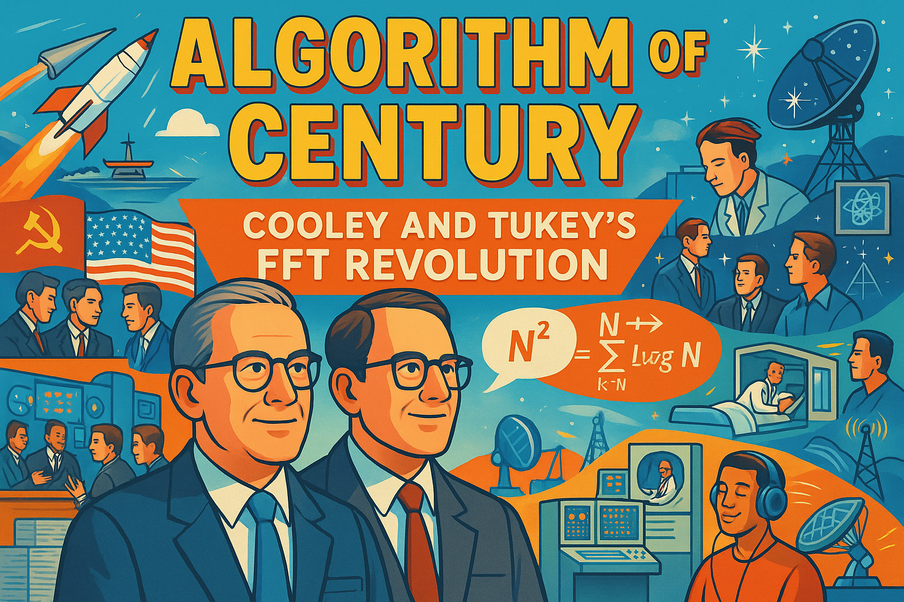

# Signal Processing Stories

## Algorithm of the Century: Cooley and Tukey's FFT Revolution
 { width="400px"}
This tells the story of how James Cooley and John Tukey revolutionized signal processing by developing the Fast Fourier Transform algorithm in 1965 during the Cold War. Born from the practical need to detect Soviet nuclear tests, their breakthrough reduced calculation time from N² to N log N operations, making previously impossible computations feasible on 1960s computers. The algorithm spread rapidly across scientific disciplines after being published, enabling real-time signal analysis for applications ranging from seismology to astronomy. The FFT ultimately transformed entire industries—creating the foundation for digital signal processing, enabling technologies like MRI machines, digital audio, telecommunications, and countless other innovations that shape our modern digital world. Their story illustrates how elegant mathematical solutions to efficiency problems can have far greater impact than raw computing power alone.

## References

Here are 10 engaging references about the Fast Fourier Transform that high school students would enjoy:

- [The FFT is Fifty](https://californiaconsultants.org/the-fft-is-fifty/) - 2015 - California Consultants - A readable celebration of the FFT's 50th anniversary that explains its significance in non-technical terms and its revolutionary impact on technology.

- [How the Cooley-Tukey FFT Algorithm Works](https://www.dsprelated.com/showarticle/1709.php) - 2019 - DSP Related - An excellent multi-part tutorial that breaks down the algorithm step-by-step with clear explanations suitable for high school students with basic math knowledge.

- [A Faster Fast Fourier Transform](https://spectrum.ieee.org/a-faster-fast-fourier-transform) - 2012 - IEEE Spectrum - Covers modern developments in FFT algorithms and explains why the original breakthrough remains so important in digital signal processing.

- [Fast Fourier Transform on Wikipedia](https://en.wikipedia.org/wiki/Fast_Fourier_transform) - Updated 2025 - Wikipedia - A comprehensive reference with history, applications, and technical details that ambitious students can explore at their own pace.

- [The Scientist and Engineer's Guide to Digital Signal Processing](https://www.dspguide.com/ch12.htm) - Free online book - A completely free online textbook with an excellent chapter on the FFT that includes clear diagrams and practical examples.

- [Understanding the Cooley-Tukey FFT](https://vanhunteradams.com/FFT/FFT.html) - Educational resource - Features step-by-step explanations with mathematical derivations that are accessible to students with high school calculus knowledge.

- [50 Years of FFT Algorithms and Applications](https://www.researchgate.net/publication/333029661_50_Years_of_FFT_Algorithms_and_Applications) - 2019 - Researchgate - A historical overview that traces the development and applications of FFT, with the full article available for download.

- [Fast Fourier Transforms - Interactive Mathematics](http://www.intmath.com/fourier-series/11-fast-fourier-transform-fft.php) - Interactive Mathematics - Features interactive examples that let students see how the FFT works in practice, with visual demonstrations.

- [FFT Demo on GitHub](https://github.com/bubnicbf/Fast-Fourier-Transform-using-Cooley-Tukey-algorithm) - GitHub - Provides actual working code examples of the FFT algorithm that programming-oriented students can experiment with directly.

- [The Cooley-Tukey FFT and Modern Computing](https://www.mathworks.com/help/signal/ug/fast-fourier-transform-fft.html) - MathWorks - Shows how the FFT is used in modern software like MATLAB, with examples of practical applications in signal processing.

These resources cover different aspects of the FFT, from its historical development to practical applications, and are presented at various levels of technical detail to accommodate different student interests and abilities.