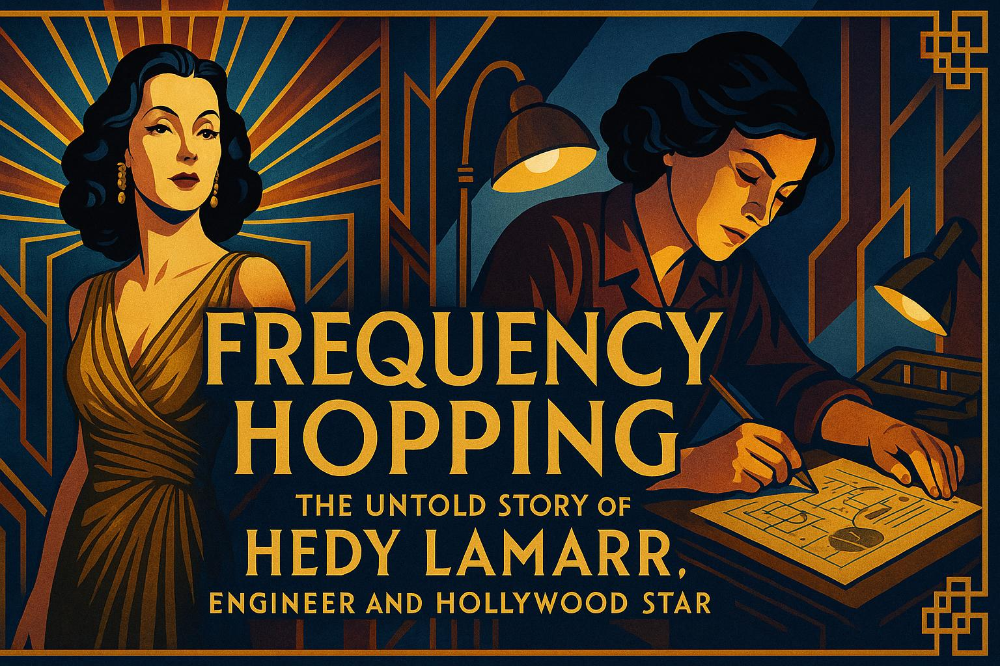
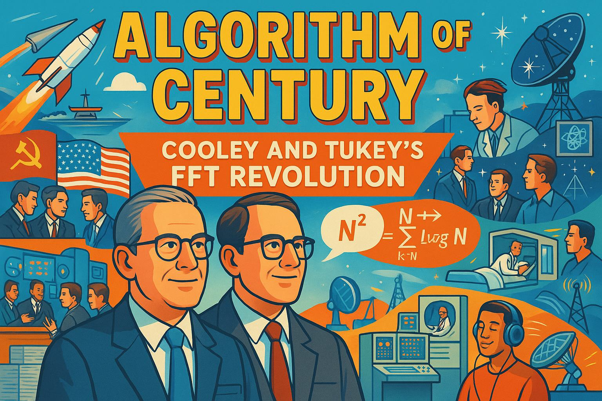
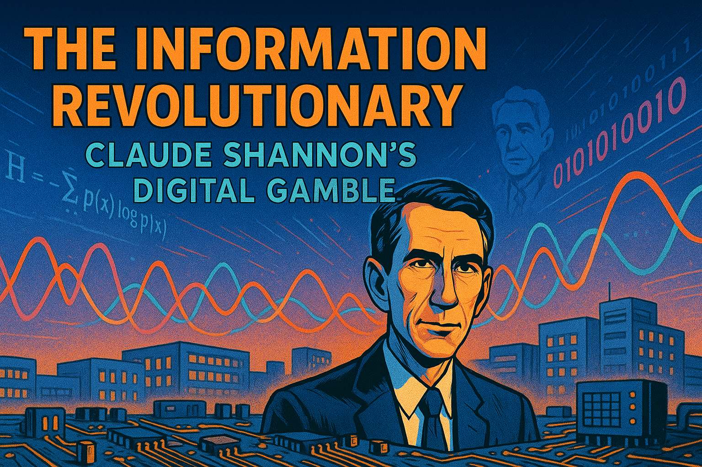
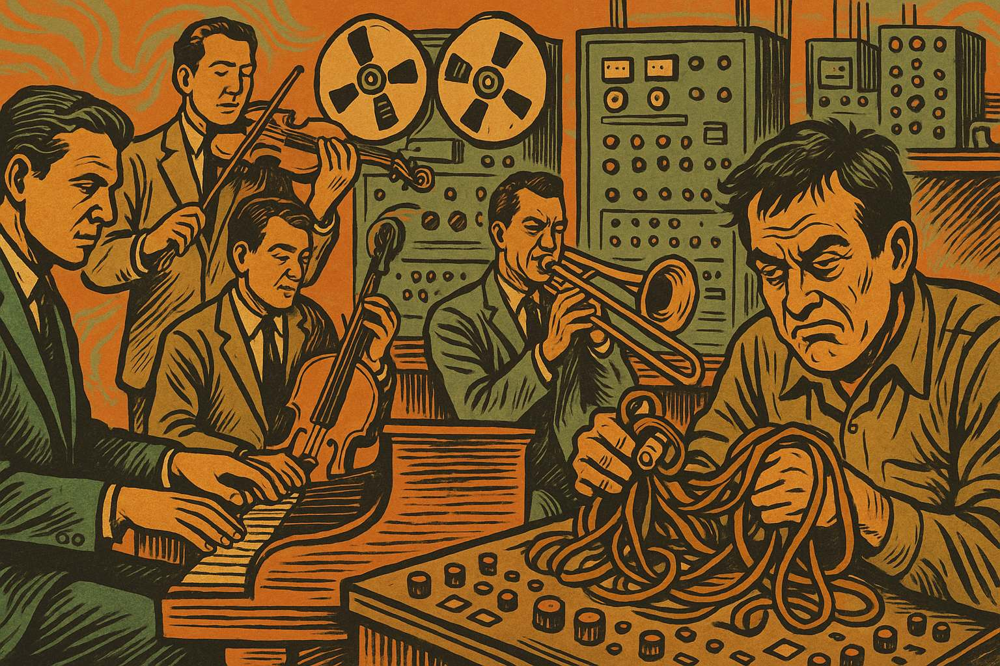
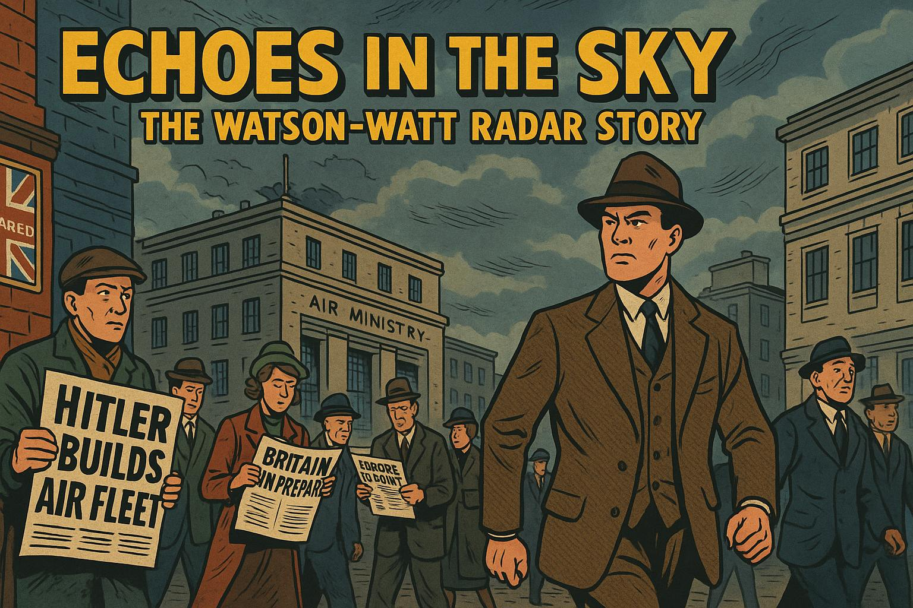

# Signal Processing Stories

These stories were created mostly by generative AI.  I used a generative AI to
generate some story ideas and then wrote some detailed prompts that created
a narrative for the stories.  Each story also included narratives that were
fed into the OpenAI DALL-E 3 text to image system.  You can see examples
of the narrative prompts, the image prompts and the reference prompts.

## Frequency Hopping: The Untold Story of Hedy Lamarr, Engineer and Hollywood Star
{width="400px"}

In the glittering world of 1940s Hollywood, Hedy Lamarr led an extraordinary double life - by day, she was a glamorous movie star dubbed "the most beautiful woman in the world," but by night, she was a brilliant inventor whose mind would revolutionize modern technology. After escaping her controlling first husband, an Austrian arms manufacturer where she secretly absorbed technical knowledge about weapons systems, Hedy fled to America and became a film star. During World War II, she conceptualized frequency-hopping technology to prevent enemy jamming of radio-controlled torpedoes, collaborating with composer George Antheil to develop a synchronization method inspired by player pianos. Though their 1942 patent was initially dismissed by the U.S. Navy, who couldn't fathom that an actress could contribute to military technology, their groundbreaking invention eventually became the foundation for secure military communications, GPS, Bluetooth, and Wi-Fi used by billions today. Hedy's remarkable story exemplifies the qualities of a great engineer - curiosity, creativity, persistence, and courage - and stands as a powerful reminder that innovation can come from unexpected places, regardless of gender or profession.

[Read the Frequency Hopping Story](./hedy-lamarr/index.md)

## Algorithm of the Century: Cooley and Tukey's FFT Revolution
{width="400px"}

This tells the story of how James Cooley and John Tukey revolutionized signal processing by developing the Fast Fourier Transform algorithm in 1965 during the Cold War. Born from the practical need to detect Soviet nuclear tests, their breakthrough reduced calculation time from N² to N log N operations, making previously impossible computations feasible on 1960s computers. The algorithm spread rapidly across scientific disciplines after being published, enabling real-time signal analysis for applications ranging from seismology to astronomy. The FFT ultimately transformed entire industries—creating the foundation for digital signal processing, enabling technologies like MRI machines, digital audio, telecommunications, and countless other innovations that shape our modern digital world. Their story illustrates how elegant mathematical solutions to efficiency problems can have far greater impact than raw computing power alone.

[Read the FFT Story](./fft/index.md)

## The Information Revolutionary: Claude Shannon's Digital Gamble
{width="400px"}

At Bell Labs in the 1940s, a young engineer named Claude Shannon made a revolutionary observation that would transform the world: information could be measured, transmitted, and processed mathematically. Working in the premier think-tank of his era, Shannon developed information theory, introducing concepts like the "bit" and showing how any information could be encoded in binary digits. His groundbreaking 1948 paper "A Mathematical Theory of Communication" laid the foundation for the digital age, enabling everything from satellite communications to the internet. Shannon's work revealed the fundamental limits of data compression and transmission, providing the mathematical framework that makes modern digital communication possible. His insights into noise, entropy, and channel capacity became the bedrock of signal processing, proving that with clever mathematics, reliable communication was possible even through noisy channels. Shannon's story demonstrates how abstract mathematical thinking can solve practical problems and create entire industries.

[Read the Shannon Story](./shannon/index.md)

## The Moog Revolution: Analog Synthesis Meets Electronic Innovation
{width="400px"}

Before Robert Moog revolutionized music in the 1960s, electronic instruments were complex, expensive machines relegated to research labs and experimental studios. Musicians were limited to traditional acoustic instruments or primitive electronic devices that required teams of technicians to operate. Moog approached the challenge differently, combining his engineering background with his passion for music to create modular synthesizers that musicians could actually use. His breakthrough innovations included voltage-controlled oscillators, filters, and amplifiers that could be patched together like an electronic puzzle. The Moog synthesizer democratized electronic music creation, putting the power of sound synthesis into the hands of individual artists. From the otherworldly sounds of "Switched-On Bach" to the iconic bass lines of funk and disco, Moog's instruments shaped the soundtrack of modern music while demonstrating how signal processing principles could create entirely new forms of artistic expression.

[Read the Moog Story](./moog/index.md)

## Echoes in the Sky: Robert Watson-Watt and the Radar Revolution
{width="400px"}

In 1934, with Nazi rearmament casting a shadow over Europe, British engineer Robert Watson-Watt faced an impossible challenge: how to defend Britain's skies against an increasingly powerful German air force. When asked to investigate the feasibility of a "death ray" weapon, Watson-Watt instead proposed something far more practical yet equally revolutionary—radar. Working against time and skepticism, he demonstrated that radio waves could detect aircraft at unprecedented distances. His team developed the Chain Home radar network, a string of coastal stations that would give Britain its first early warning system. During the Battle of Britain, these "echoes in the sky" provided crucial advance notice of incoming German bombers, allowing RAF fighters to intercept threats with devastating effectiveness. Watson-Watt's radar technology, built on principles of signal processing and electromagnetic wave propagation, not only helped save Britain but became fundamental to modern navigation, weather forecasting, and countless civilian applications.

[Read the Radar Story](./radar-in-ww2/index.md)

## The Wavelet Revolution: Ingrid Daubechies' Mathematical Journey

Ingrid Daubechies, a brilliant Belgian mathematician working in her garden in 1980, saw mathematical patterns where others saw only flowers and soil. Recognizing the limitations of traditional Fourier transforms in analyzing real-world signals that change over time, she worked tirelessly to develop a revolutionary alternative. In 1987, despite skepticism from her male-dominated field, Daubechies created the first orthogonal wavelets with compact support—mathematical building blocks that could capture both frequency and time information in signals. Her breakthrough transformed numerous fields, from digital image compression to medical imaging, ultimately becoming fundamental to modern technologies like JPEG2000 and MP3 files. Breaking glass ceilings, she received the MacArthur "Genius" Fellowship and became the first female president of the International Mathematical Union and the first female full professor in Princeton's Mathematics Department. Beyond her mathematical contributions, Daubechies demonstrated that the qualities of great engineers and scientists—persistence, creativity, courage, and connecting abstract ideas to practical needs—are not limited by gender, creating waves of change that continue to inspire diverse new generations of mathematicians and engineers.

[Read the Wavelets Story](./wavelets/index.md)
