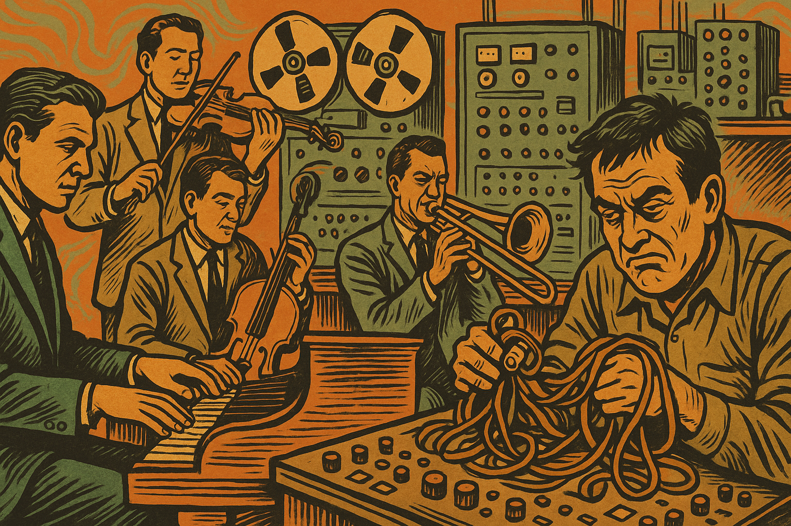
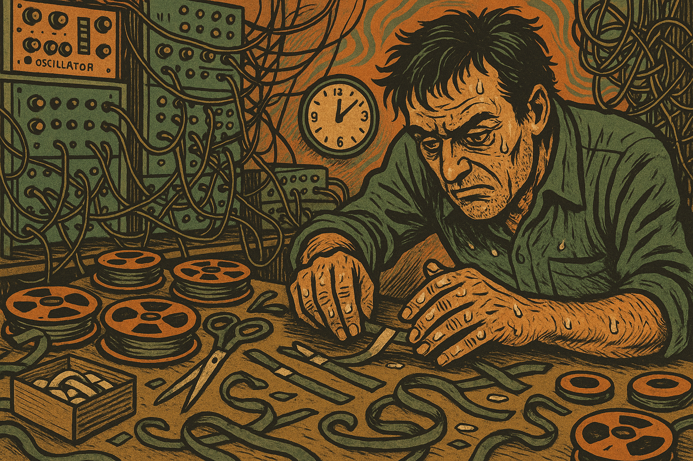
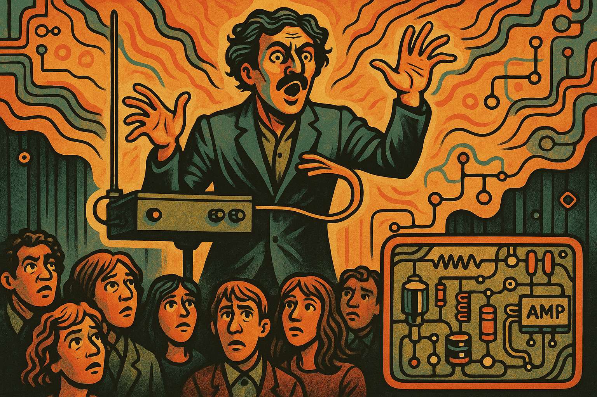
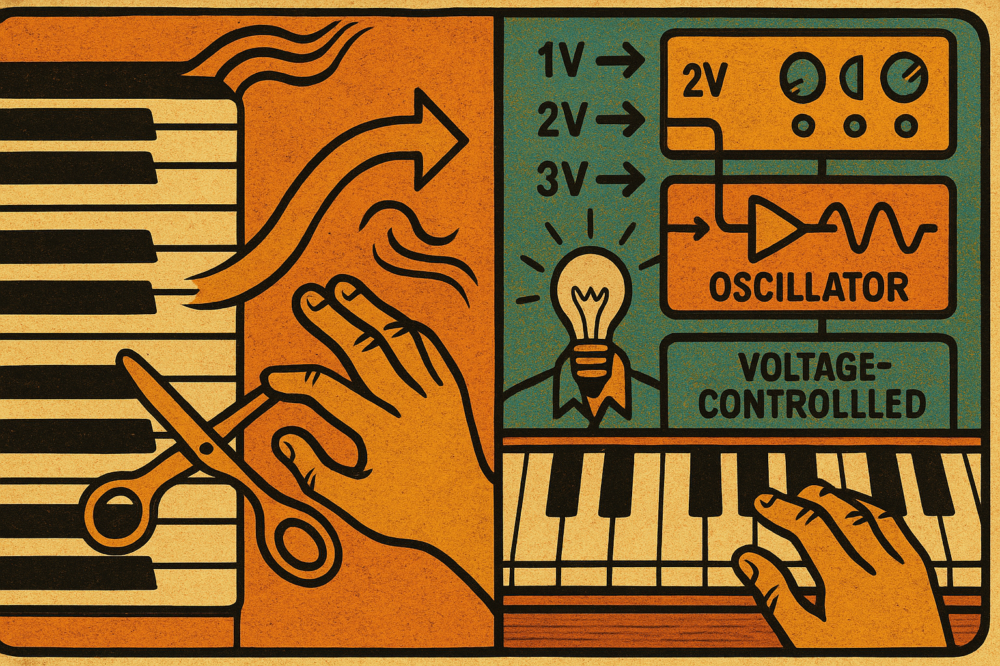
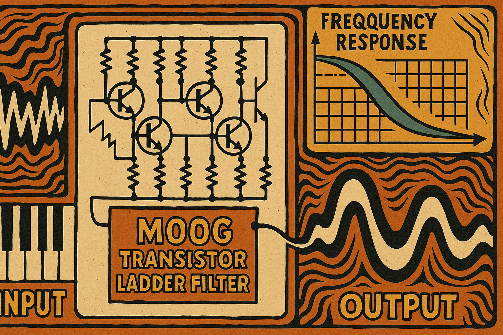
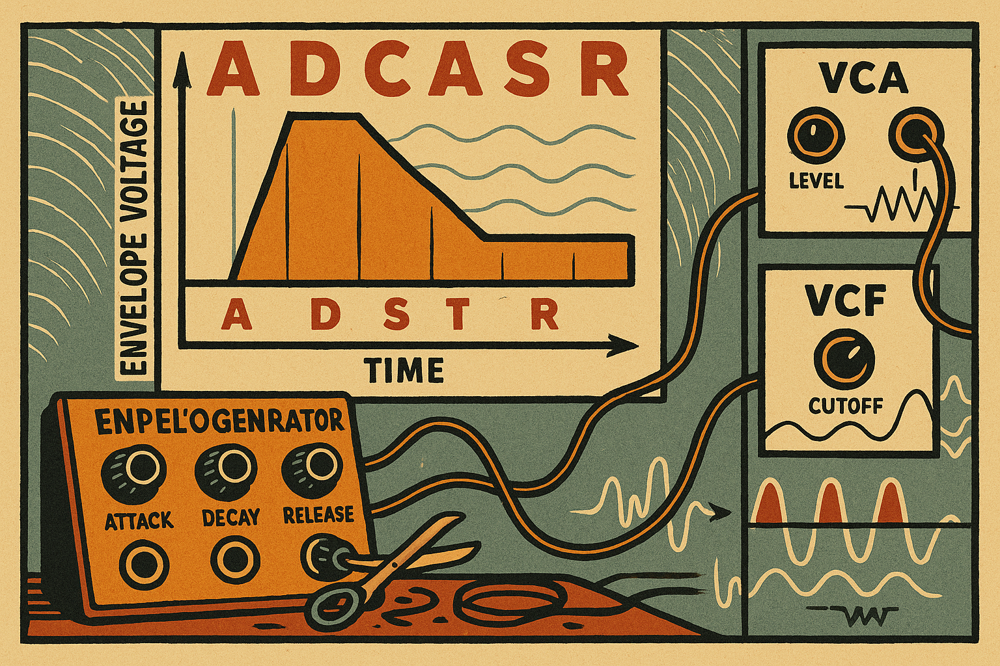
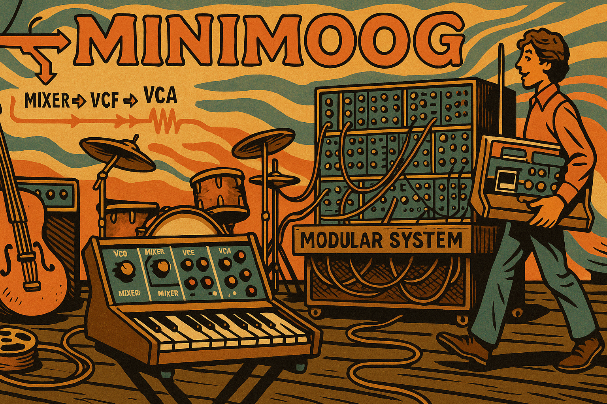
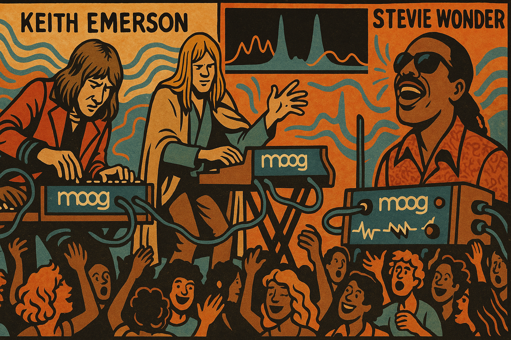

# The Moog Revolution: A Signal Processing Story

    
Narrative Prompt

    Please generate a text narrative of the story of the Moog music synthesizer.

The narrative is the outline of a graphic novel with about 12 panels.

The graphic novel is targeting high-school and college students that might be interested in signal processing.

Begin with the state of the music industry before Moog.

What were the challenges the sound engineers before Moog?

How did Moog approach things differently?

How did Moog overcome the challenges?

What innovations did Moog create?

What were the key signal processing innovations used?  Show some details.

What was the result?  How did it impact the music industry?

For each of the panels, return the following format

## Panel Name

   
image prompt

  Please generate a new wide-landscape drawing in the style of a graphic novel.  

  Use a a drawing style and colors that were popular at the time the Moog was created.

   [detailed description of the image used by a text-to-image program]

## Panel 1: The Dawn of Electronic Music

   
image prompt

Please generate a new wide-landscape drawing in the style of a graphic novel.  
Use a drawing style and colors that were popular at the time the Moog was created (1960s - earthy tones, bold lines, psychedelic influences).

Show a 1950s recording studio with musicians gathered around traditional acoustic instruments - piano, violin, brass instruments. In the background, show large reel-to-reel tape machines and primitive electronic equipment. The scene should convey the limitation of the era - everything is either acoustic or requires complex tape manipulation. Include a sound engineer looking frustrated while working with tangled tape loops.

Before the 1960s, electronic music was a realm of mad scientists and avant-garde composers. Musicians were limited to acoustic instruments, while electronic sounds required expensive studio equipment, complex tape manipulation, and hours of tedious work to create even simple effects.

## Panel 2: The Tape Music Challenge

   
image prompt

Please generate a new wide-landscape drawing in the style of a graphic novel.  
Use a drawing style and colors that were popular at the time the Moog was created (1960s - earthy tones, bold lines, psychedelic influences).

Show a composer hunched over a large tape editing table, surrounded by scissors, tape splices, and dozens of tape reels. The room is cluttered with electronic oscillators, tone generators, and complex patch cables. Show the composer's hands covered in tape adhesive, with a clock showing it's 3 AM, emphasizing the time-consuming nature of creating electronic music.

Electronic music pioneers like Karlheinz Stockhausen and Pierre Schaeffer spent countless hours cutting and splicing magnetic tape to create otherworldly sounds. Each note required manual manipulation, making real-time performance impossible and composition incredibly labor-intensive.

## Panel 3: The Thereminvox Limitation

   
image prompt

Panel 3: Please generate a new wide-landscape drawing in the style of a graphic novel.  
Use a drawing style and colors that were popular at the time the Moog was created (1960s - earthy tones, bold lines, psychedelic influences).

Show a theremin player on stage, hands waving mysteriously in the air around the antenna-like instrument. The audience looks both fascinated and confused. Show wavy lines emanating from the theremin to represent the eerie sound waves. In the corner, show a close-up of the theremin's simple electronic circuitry with basic oscillators and amplifiers.

The theremin, invented in the 1920s, was one of the first electronic instruments, but it was notoriously difficult to play with precision. Its oscillators produced continuous tones controlled by hand position in electromagnetic fields - a concept that would inspire future voltage-controlled synthesis.

## Panel 4: Enter Robert Moog

   
image prompt

Panel 4: Please generate a new wide-landscape drawing in the style of a graphic novel.  
Use a drawing style and colors that were popular at the time the Moog was created (1960s - earthy tones, bold lines, psychedelic influences).

Show a young Robert Moog in his workshop/garage in the early 1960s, surrounded by electronic components, circuit boards, and engineering books. He's holding a voltage-controlled oscillator circuit board, with a lightbulb moment expression. Show technical drawings and oscilloscope traces on the wall behind him, emphasizing his engineering background and innovative thinking.

In 1963, Robert Moog, a young engineer and theremin enthusiast, had a revolutionary idea: What if electronic music instruments could be controlled by voltage rather than requiring manual manipulation? This concept would become the foundation of modern synthesizers.

## Panel 5: The Voltage-Controlled Revolution

   
image prompt

Panel 5: Please generate a new wide-landscape drawing in the style of a graphic novel.  
Use a drawing style and colors that were popular at the time the Moog was created (1960s - earthy tones, bold lines, psychedelic influences).

Show a technical diagram split-screen: on the left, show a traditional piano keyboard with mechanical keys, and on the right, show Moog's voltage-controlled system with a keyboard outputting different voltage levels (1V, 2V, 3V, etc.) connected to electronic modules. Use arrows and waveforms to show how pressing keys generates specific voltages that control oscillator frequency.

Moog's breakthrough was voltage control: pressing a key would output a specific voltage (following the 1 volt per octave standard), which could electronically control the frequency of oscillators. This meant musicians could play electronic sounds with the same precision as acoustic instruments.

## Panel 6: The Modular Signal Chain

   
image prompt

Please generate a new wide-landscape drawing in the style of a graphic novel.  
Use a drawing style and colors that were popular at the time the Moog was created (1960s - earthy tones, bold lines, psychedelic influences).

Show a detailed view of the Moog modular system with three main components: VCO (Voltage Controlled Oscillator) generating sawtooth and square waves, VCF (Voltage Controlled Filter) shaping the harmonic content, and VCA (Voltage Controlled Amplifier) controlling volume. Use patch cables connecting the modules and show signal flow with arrows and waveform representations.

Moog created a modular signal processing chain: VCO (Voltage Controlled Oscillator) generated the raw waveforms, VCF (Voltage Controlled Filter) shaped the harmonic content using analog filter circuits, and VCA (Voltage Controlled Amplifier) controlled the amplitude envelope - the same fundamental signal path used in synthesizers today.

## Panel 7: The Filter Innovation

   
image prompt

Panel 7: Please generate a new wide-landscape drawing in the style of a graphic novel.  
Use a drawing style and colors that were popular at the time the Moog was created (1960s - earthy tones, bold lines, psychedelic influences).

Show a detailed cross-section of the famous Moog ladder filter circuit, with its characteristic transistor ladder arrangement. Display frequency response curves showing how the filter affects different frequencies, with the distinctive 24dB/octave rolloff. Show both the circuit schematic and the resulting audio waveforms before and after filtering.

The legendary Moog ladder filter became the signature sound of the synthesizer. Using a cascade of transistors in a "ladder" configuration, it provided a distinctive 24dB per octave low-pass filter with resonance control - creating the warm, musical distortion that defined the Moog sound.

## Panel 8: Envelope Generators and Modulation

   
image prompt

Panel 8: Please generate a new wide-landscape drawing in the style of a graphic novel.  
Use a drawing style and colors that were popular at the time the Moog was created (1960s - earthy tones, bold lines, psychedelic influences).

Show the ADSR envelope generator concept with a clear graph displaying Attack, Decay, Sustain, and Release phases over time. Below, show how this envelope voltage controls both the VCA (for volume shaping) and VCF (for filter sweeps). Include patch cables connecting the envelope generator to multiple destinations, illustrating the modular control concept.

Moog pioneered the ADSR envelope generator (Attack, Decay, Sustain, Release), which created voltage curves over time to shape sounds dynamically. This same envelope could modulate multiple parameters simultaneously - making electronic sounds feel alive and expressive rather than static.

## Panel 9: Wendy Carlos and Switched-On Bach

   
image prompt

Panel 9: Please generate a new wide-landscape drawing in the style of a graphic novel.  
Use a drawing style and colors that were popular at the time the Moog was created (1960s - earthy tones, bold lines, psychedelic influences).

Show Wendy Carlos at a large Moog modular synthesizer in a recording studio, carefully programming and recording Bach's compositions. Show multiple tape tracks being layered to create complex arrangements. In the background, display the "Switched-On Bach" album cover and show people's surprised reactions to hearing classical music played on electronic instruments.

In 1968, Wendy Carlos released "Switched-On Bach," proving that synthesizers could create serious, beautiful music. Each note was painstakingly programmed and recorded in multiple passes, demonstrating the musical potential of voltage-controlled synthesis and bringing electronic music to mainstream audiences.

## Panel 10: The Minimoog Goes Portable

   
image prompt

Panel 10: Please generate a new wide-landscape drawing in the style of a graphic novel.  
Use a drawing style and colors that were popular at the time the Moog was created (1960s - earthy tones, bold lines, psychedelic influences).

Show the compact Minimoog synthesizer sitting on a stage next to traditional rock instruments. Compare its size to the massive modular systems in the background. Show a musician easily carrying the Minimoog, emphasizing its portability. Include signal flow arrows showing how the built-in modules connect in the optimized signal path.

In 1970, Moog released the Minimoog - a compact, portable synthesizer that put the essential signal processing modules (oscillators, filter, envelope) in an optimized, preset configuration. This made advanced electronic music accessible to working musicians for the first time.

## Panel 11: Rock and Pop Revolution

   
image prompt

Panel 11: Please generate a new wide-landscape drawing in the style of a graphic novel.  
Use a drawing style and colors that were popular at the time the Moog was created (1960s - earthy tones, bold lines, psychedelic influences).

Show famous musicians like Keith Emerson, Rick Wakeman, and Stevie Wonder performing with Moog synthesizers. Display sound waves and frequency spectrums showing the rich harmonic content that the Moog added to popular music. Show crowds dancing to electronic sounds that were previously impossible to create in live performance.

Progressive rock and pop artists embraced the Moog's capabilities, creating sounds never before heard in popular music. The synthesizer's voltage-controlled signal processing allowed for precise, repeatable sounds that could be performed live, revolutionizing the sonic palette of popular music.

## Panel 12: Legacy and Modern Impact

   
image prompt

Panel 12: Please generate a new wide-landscape drawing in the style of a graphic novel.  
Use a drawing style and colors that were popular at the time the Moog was created (1960s - earthy tones, bold lines, psychedelic influences).

Show a timeline from the 1960s to today, with the original Moog modular system evolving into modern digital synthesizers, software plugins, and smartphone apps. Show the same fundamental signal processing concepts (oscillators, filters, envelopes) being implemented in both analog and digital domains. Include diverse musicians from different genres all using these same core concepts.

Robert Moog's voltage-controlled signal processing concepts became the foundation of all modern electronic music. From analog to digital, from hardware to software, the basic principles of oscillators, filters, and envelopes that Moog pioneered continue to shape how we create and manipulate sound today. Every synthesizer, from massive studio systems to smartphone apps, owes its conceptual DNA to Moog's revolutionary approach to electronic signal processing.

**The End**

*The story of the Moog synthesizer demonstrates how innovative signal processing techniques can transform entire industries. Moog's voltage-controlled modules remain the fundamental building blocks of modern synthesis, proving that elegant engineering solutions can have profound cultural impact.*
