# Echos in the Sky: How Robert Watson-Watt Saved Britain during WW-II

## Panel 1: "A Sky Full of Fear"

The story begins in 1934, with newspaper headlines screaming about Nazi rearmament. A fearful public and unprepared military contrast with the confident stride of a determined engineer—Robert Watson-Watt—walking into the British Air Ministry.

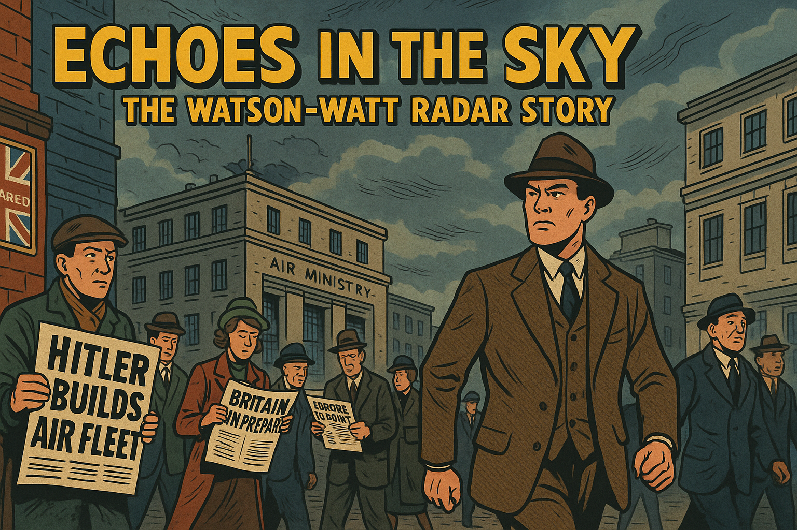

  
Image Prompt

  Please generate a wide-landscape drawing using the style of a graphic novel.  
  Use bright colors and the style of drawing should reflect the time around World War II.  
  DETAILED DESCRIPTION HERE:  
  A war-era London street scene with ominous newspaper headlines like “Hitler Builds Air Fleet” and “Britain Unprepared.” In the foreground, a man in a tweed suit (Watson-Watt) strides past a newsstand with determination. The background includes anxious citizens and war posters. Skies are cloudy, hinting at the coming storm.

---

## Panel 2: "The 'Death Ray' Proposal"

Narrative:
British officials are searching for fantastical weapons. Watson-Watt is summoned to evaluate the feasibility of a "death ray." He calmly responds: “No ray, but perhaps... a wave.”

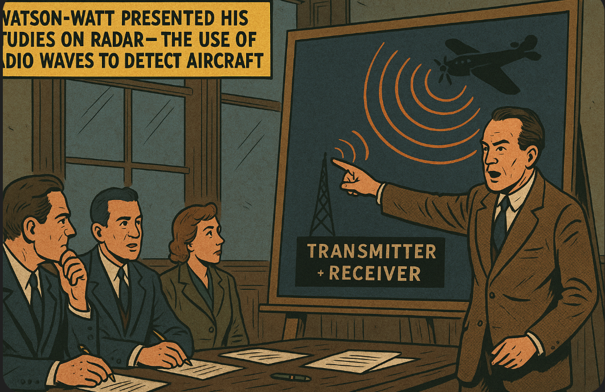

  
Image Prompt

  Please generate a wide-landscape drawing using the style of a graphic novel.  
  Use bright colors and the style of drawing should reflect the time around World War II.  
  DETAILED DESCRIPTION HERE:  
  A wood-paneled military conference room with uniformed officials and scientists gathered around a long table. One officer presents a crude “death ray” sketch. Watson-Watt, seated modestly at the end, lifts a finger and says “No ray, but perhaps... a wave.” Papers and radios scattered across the table emphasize early electronics.

---

## Panel 3: "The Spark of Signal Processing"

Narrative:
Watson-Watt returns to his lab, pondering: “If we bounce radio waves off aircraft… we can detect them. But how do we process the signal from all that noise?”

  
Image Prompt

  Please generate a wide-landscape drawing using the style of a graphic novel.  
  Use bright colors and the style of drawing should reflect the time around World War II.  
  DETAILED DESCRIPTION HERE:  
  A dimly lit lab with shelves of vacuum tubes, early oscilloscopes, and signal charts. Watson-Watt stands beside his assistant Arnold Wilkins at a cluttered workbench. A chalkboard shows a sine wave and formulas. Watson-Watt's face shows excitement, gesturing to a sketch of waves bouncing off a plane.

---

## Panel 4: "Daventry Test – Proof at Last"

Narrative:
February 1935. In a snowy field near Daventry, they aim a receiver toward a BBC transmitter. A bomber flies overhead—blips appear. It works.

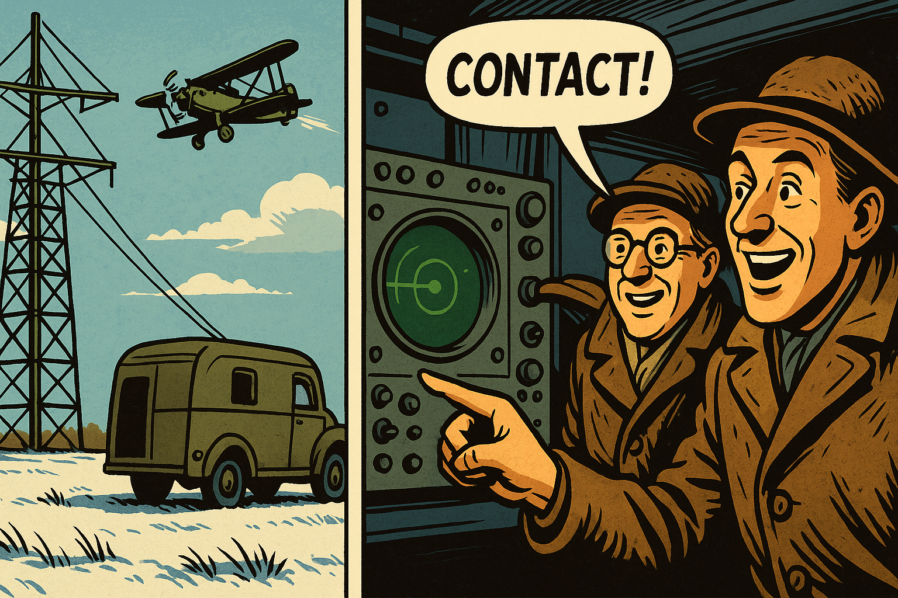

  
Image Prompt

  Please generate a wide-landscape drawing using the style of a graphic novel.  
  Use bright colors and the style of drawing should reflect the time around World War II.  
  DETAILED DESCRIPTION HERE:  
  An open snowy field with a military van, antenna setup, and bundled-up engineers watching an oscilloscope inside. In the sky, a single biplane bomber passes. The oscilloscope shows faint blips. The technician shouts “Contact!” and Watson-Watt smiles triumphantly.

## Panel 5: "Convincing the Brass"

Narrative:
Armed with evidence, Watson-Watt gives a dramatic presentation to skeptical military leaders. “This isn’t fantasy. It’s science that sees beyond the clouds.”

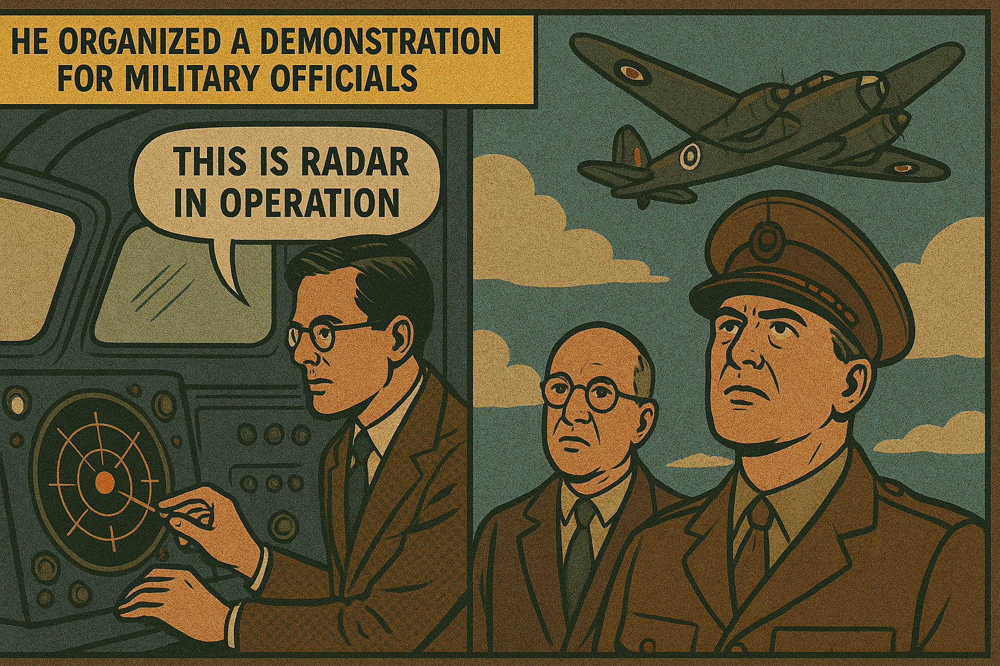
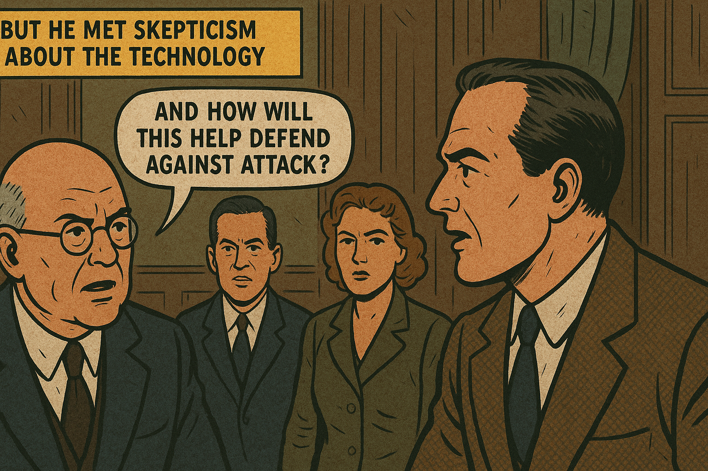
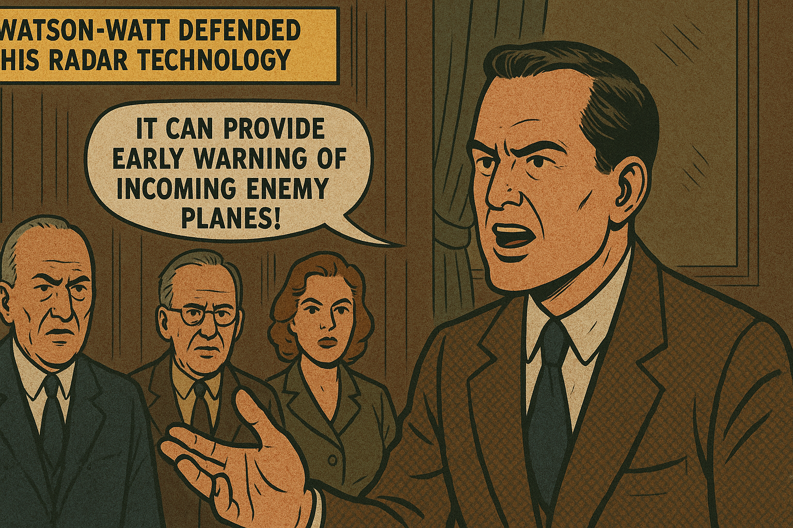
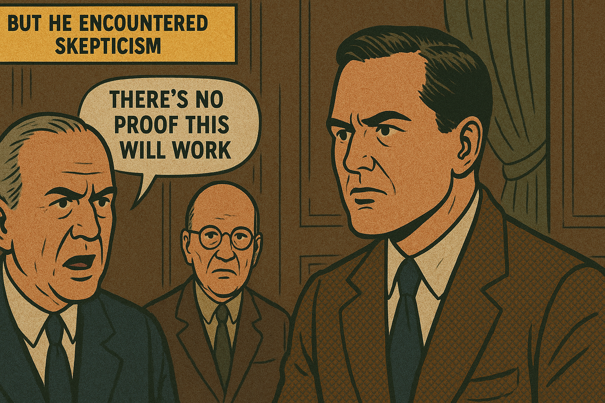
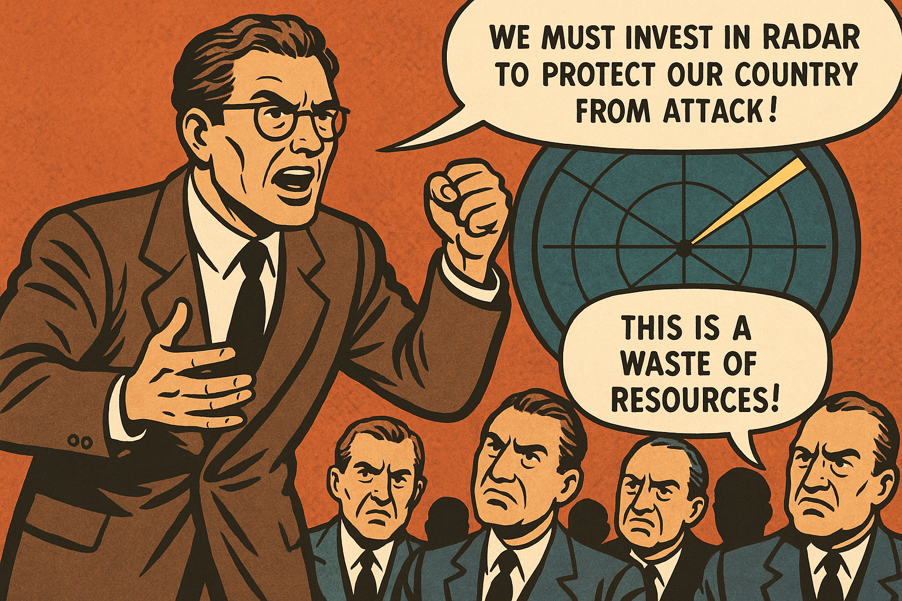
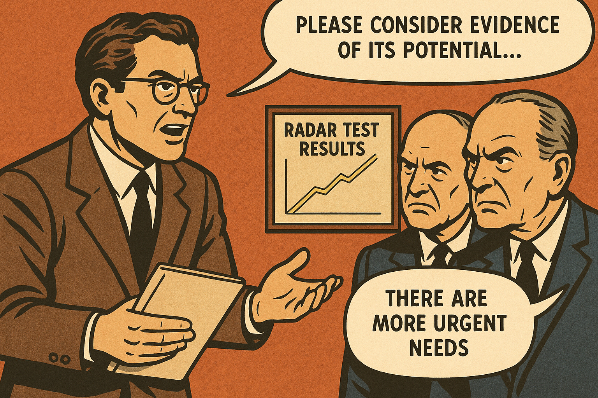

  
Image Prompt

  Please generate a wide-landscape drawing using the style of a graphic novel.  
  Use bright colors and the style of drawing should reflect the time around World War II.  
  DETAILED DESCRIPTION HERE:  
  A dark briefing room lit by a projector showing a radar screen mockup. Watson-Watt stands confidently at the front, gesturing to a chalkboard showing wave reflections. Military brass sit skeptical, arms crossed, but one younger officer leans in intrigued. 

## Panel 6: "The Chain Begins"

Narrative:
He receives funding to build the "Chain Home" radar stations. Towers rise along the coast, each transmitting signals into the sky.

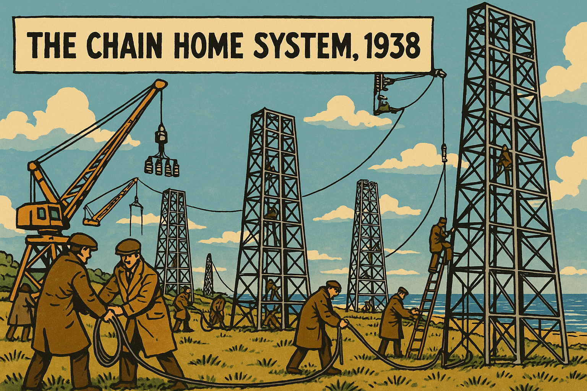

  
Image Prompt

  Please generate a wide-landscape drawing using the style of a graphic novel.  
  Use bright colors and the style of drawing should reflect the time around World War II.  
  DETAILED DESCRIPTION HERE:  
  British countryside with radar towers under construction, cranes lifting components. Teams of engineers in trench coats and flat caps install cables. In the background, the ocean glimmers. A title banner reads: “The Chain Home System, 1938.”

---

## Panel 7: "Reading the Echoes"

Narrative:
Radar operators, mostly women, watch green circular screens in darkened rooms. Blips reveal unseen enemies miles away.

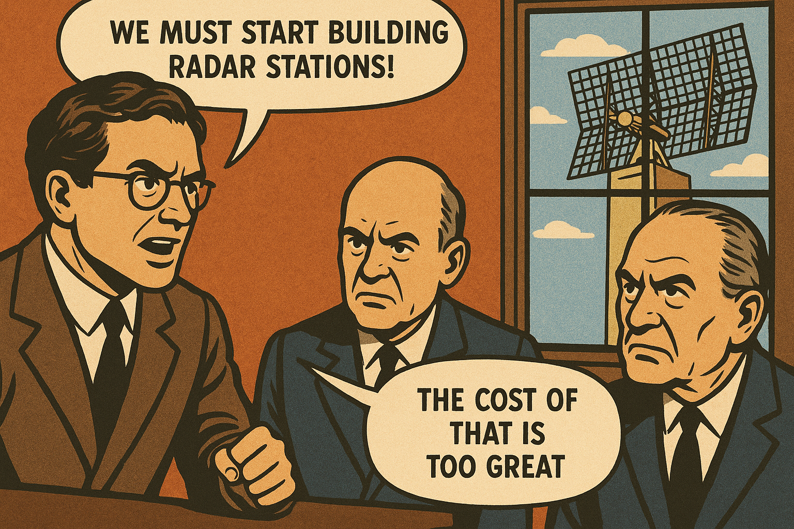
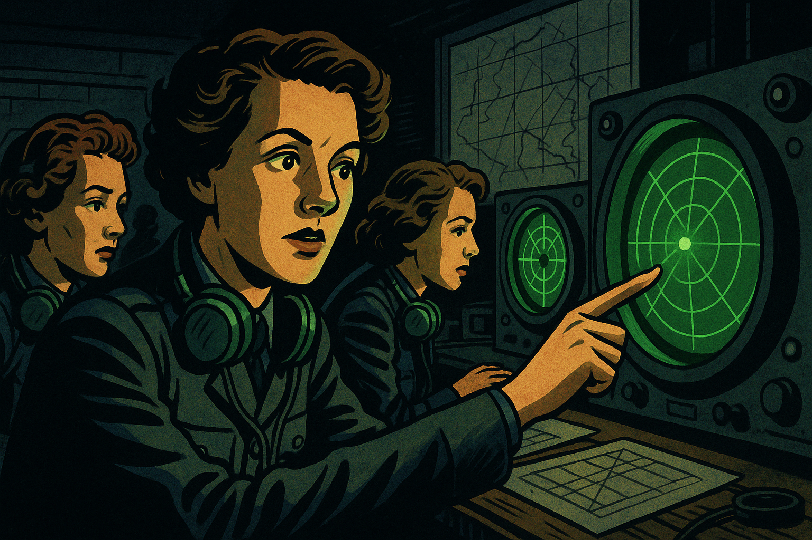

  
Image Prompt

  Please generate a wide-landscape drawing using the style of a graphic novel.  
  Use bright colors and the style of drawing should reflect the time around World War II.  
  
  Inside a darkened radar bunker deep underground, British WAAF operators in uniform monitor green cathode-ray radar displays. One points to a moving blip. Green glow from the screens lights their faces. Headphones hang around their necks. Maps and plotting boards are nearby.

---

## Panel 8: "The Blitz Begins"

Narrative:
As Nazi bombers cross the Channel, Britain braces. Radar detects them early. RAF squadrons are scrambled with precious minutes to spare.

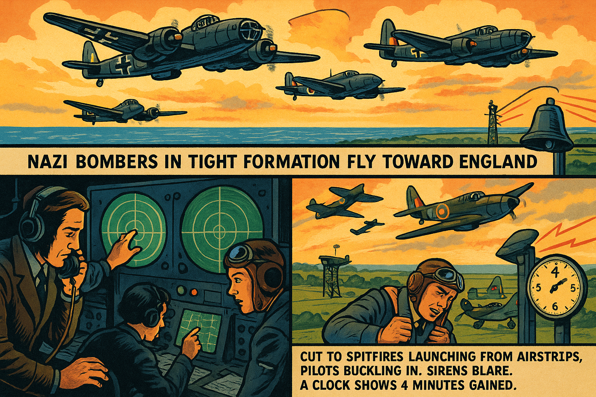

  
Image Prompt

  Please generate a wide-landscape drawing using the style of a graphic novel.  
  Use bright colors and the style of drawing should reflect the time around World War II.  
  Nazi bombers in tight formation fly toward England. In the foreground, radar operators report data. Cut to Spitfires launching from airstrips, pilots buckling in. Sirens blare. A clock shows 4 minutes gained. 

---

## Panel 9: "Victory in the Shadows"

Narrative:
Thanks to radar, British fighter pilots intercept waves of bombers. The tide turns. Radar becomes the silent hero behind every victory.

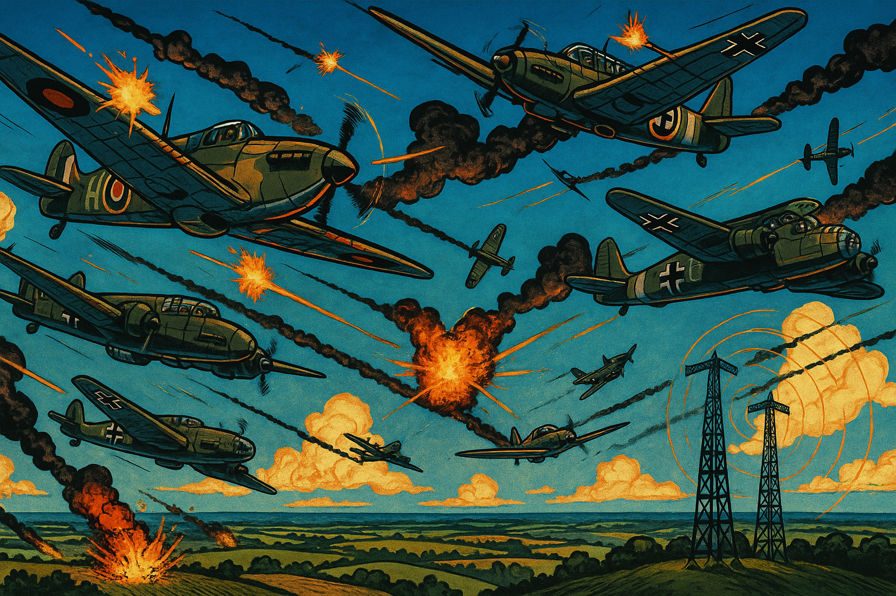

  
Image Prompt

  Please generate a wide-landscape drawing using the style of a graphic novel.  
  Use bright colors and the style of drawing should reflect the time around World War II.  
  DETAILED DESCRIPTION HERE:  
  A dramatic dogfight scene in the sky. RAF fighters engage German bombers above the countryside. Smoke trails, explosions, and tracer rounds fill the air. In the lower corner, radar towers stand like silent sentinels with beams extending into the sky.

---

## Panel 10: "Unsung Engineer"

Narrative:
Watson-Watt walks through London after an air raid. Buildings smolder. Civilians thank the pilots, but no one notices the man who gave them the warning.

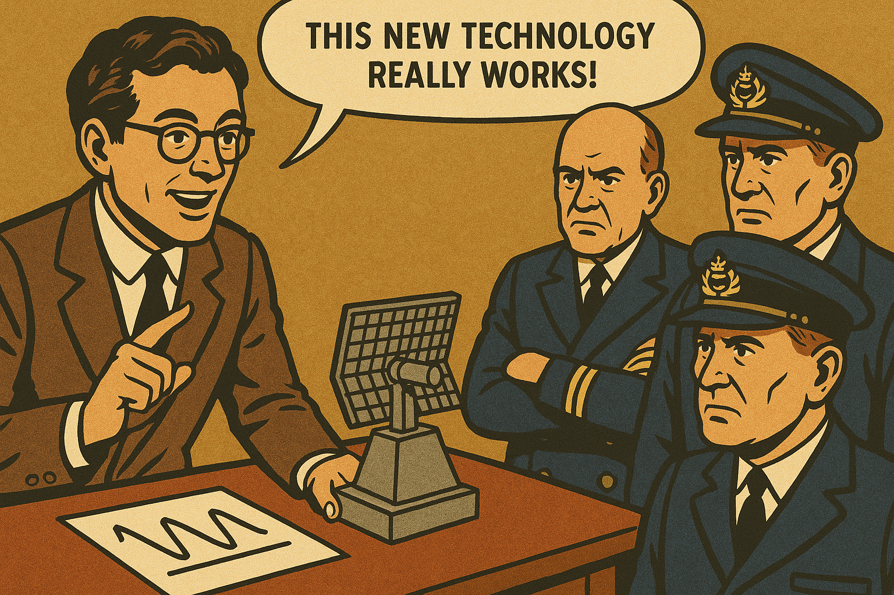

  
Image Prompt

  Please generate a wide-landscape drawing using the style of a graphic novel.  
  Use bright colors and the style of drawing should reflect the time around World War II.  
   
  A bombed-out London street at dusk. People cheer returning pilots. In the background, Watson-Watt walks alone, coat flapping, eyes downcast but satisfied. Rubble smolders beside a toppled lamppost. A “Thank you RAF!” banner waves.

---

## Panel 11: "Legacy of the Wave"

Narrative:
In a quiet lab years later, young engineers study signal processing. A portrait of Watson-Watt hangs beside a whiteboard of radar equations.

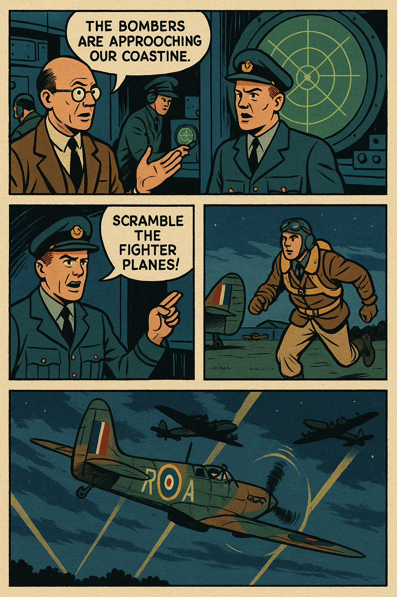

  
Image Prompt

  Please generate a wide-landscape drawing using the style of a graphic novel.  
  Use bright colors and the style of drawing should reflect the time around World War II.  
  DETAILED DESCRIPTION HERE:  
  A modern 1950s-era university lab with students analyzing radar waveforms on paper and scopes. On the wall is a framed photo of Watson-Watt and a “RADAR Pioneer” plaque. One student points to a waveform saying “This saved Britain.”

## Panel 12: "The Power of Processing"

Narrative:
Final panel. A voiceover:
“Behind every breakthrough is a signal—
It takes a mind like Watson-Watt’s to hear it clearly.”

  
Image Prompt

  Please generate a wide-landscape drawing using the style of a graphic novel.  
  Use bright colors and the style of drawing should reflect the time around World War II.  
  DETAILED DESCRIPTION HERE:  
  A symbolic panel showing a stylized radar wave expanding across time. Overlay ghosted images of Watson-Watt, an oscilloscope, a fighter plane, and a classroom. The waves ripple outward to show the legacy of signal processing.

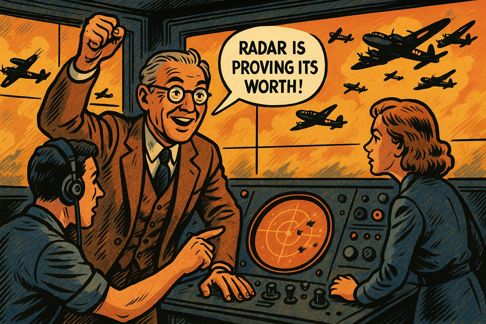

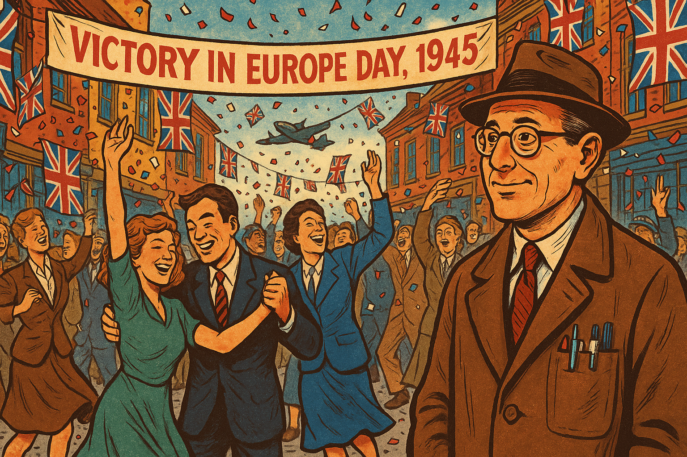

    
Image Prompt

    Please generate a wide-landscape drawing using the style of a graphic novel.  
    Use bright colors and the style of drawing should reflect the time around World War II.

    Create a conclusion image of people in England celebrating the victory at the end of WW-II.  In the crowd stands a humble engineer, confident that his contribution to signal processing helped win the war.

