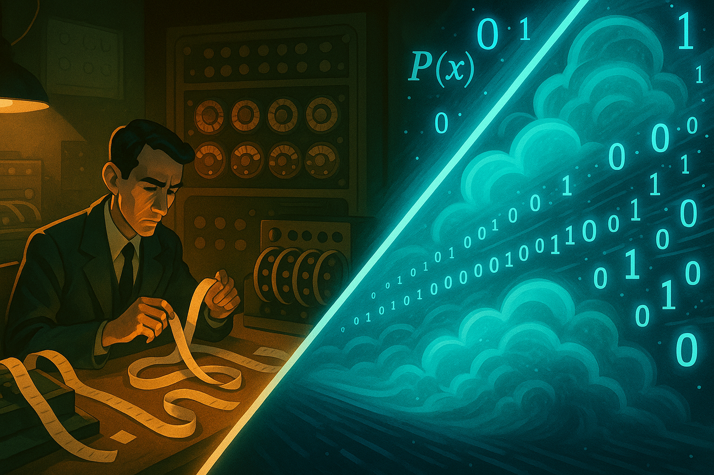

# The Information Revolutionary: Claude Shannon's Digital Gamble

    
Narrative Prompt

Please generate a detailed narrative for a new graphic novel about Claude Shannon
and his contributions to Signal Processing.  The target audience is advanced seniors in
high school or freshman in college.

The story begins when Claude Shannon was a young engineer at Bell Labs in the 1940s.
Describe how Bell Labs was the premier think-tank for research at the time.
Describe how many innovations can from within Bell Labs that impacted not just
telephones, but how we communicate with each other.

Describe how Shannon came to Bell Labs and what his initial role was.

Then describe how he defied conventional thinking by reimagining how information itself can be understood through mathematics.

This story follows Shannon as he develops information theory while working on wartime cryptography projects, showing how his playful nature (riding unicycles through Bell Labs hallways while juggling) and mathematical brilliance led to creating the foundation for our digital world.

The story highlights how Shannon's revolutionary 1948 paper that defined "bits" of information transformed communication theory and laid the groundwork for computers, smartphones, and the internet we use today.

Finally, generalize about the skills needed to be a great engineer and promote change. Our goal is to have you generate the full text of the story, but to turn the story into a graphic novel with many illustrations that explain how the Hedy invited the ideas of frequency shifting.

When appropriate, suggest an wide-landscape drawing that could be inserted into the narrative to make the story a graphic novel. Describe each image in detail and be consistent across all the images in the story for style.

When you describe an image, make sure to mention that it should be a colorful, bright wide-landscape illustration using a tech-forward optimistic style.

## Response

## ChatGPT Said (OpenAI o3)

### Prologue – A World on the Brink of Digital Discovery

In the early-1940s, long before “Wi-Fi,” “smartphones,” or even “computers” as we know them, the beating heart of American innovation was **Bell Telephone Laboratories** in Murray Hill, New Jersey. Inside its limestone walls, Nobel laureates rubbed shoulders with tinkering technicians; ideas leapt from quantum theory to vacuum-tube amplifiers before lunch and from satellite orbits to transistorized hearing aids by dinner. The lab’s mantra was simple: *solve problems nobody else can even phrase.*

Image Prompt

Image 1:
Please generate a new wide-landscape illustration.
A colorful, bright wide-landscape illustration in a tech-forward optimistic style showing the grand façade of Bell Labs in the 1940s. Scientists in white lab coats and navy suits stream through art-deco doors while giant, translucent circuit diagrams float above the building, hinting at ideas yet to be born.

### Chapter 1 – Enter Claude Shannon

Claude Elwood Shannon arrived at Bell Labs in 1941, fresh from completing his master’s thesis at MIT that proved telephone switchboards and Boolean algebra were two sides of the same coin. Bell Labs hired the shy, 25-year-old engineer as a mathematical consultant in the “Relay and Switching” group—hardly glamorous, but the perfect sandbox for a mind that relished puzzles.

Shannon’s first tasks were to optimize electromechanical relay circuits that routed millions of calls across the American continent. Yet, as he traced wires and contacts, he asked a question few engineers dared: **“What if signals aren’t merely voltages on copper, but *abstract units* that obey mathematical laws?”**

Image Prompt

Image 2:
Please generate a new wide-landscape illustration.
Shannon, slender and boyish, studies a maze-like relay panel. Above his head, ghostly Boolean algebra symbols morph into telephone relays, blending math and machinery in a bright, wide-landscape illustration.

---

### Chapter 2 – Bell Labs: A Playground of Possibility

Bell Labs housed radar pioneers, wartime code-breakers, and the soon-to-be inventors of the transistor. Colleagues shared cafeterias and chalkboards, turning lunch breaks into spontaneous seminars. In this crucible, Shannon’s *playful genius* flourished. He famously rode a unicycle down the corridor while juggling three beanbags, a grin framing his analytical eyes—because for Shannon, play and discovery were the same verb.

Image Prompt

Image 3:
Please generate a new wide-landscape illustration.
A wide-landscape corridor scene: Claud Shannon pedals a unicycle beneath fluorescent lights, juggling colorful beanbags that trace rainbow arcs. Around him, astonished engineers clutch slide rules, while equations float like neon graffiti along the hallway walls.

---

### Chapter 3 – War, Cryptography, and the Birth of Information Theory

World War II thrust Bell Labs into cryptographic research. Shannon joined a hush-hush team crafting secure voice scramblers and analyzing enemy ciphers. Exposure to secret-keeping sharpened his conviction that **communication is fundamentally the battle between *signal* and *noise*.**

Working nights, he sketched probability curves on endless yellow pads, formulating a theory where messages, no matter their medium—radio waves, telegraph clicks, or drumbeats—could be quantified by *choices between alternatives*. He dubbed the basic unit of choice a **“binary digit,”** quickly shortened to **bit**.

> *“Information,” Shannon wrote to a colleague, “is the *reduction of uncertainty*.”*

Image Prompt

Image 4:
Please generate a new wide-landscape illustration.
A tech-forward wide-landscape illustration split diagonally: left side, a dim war-room with code tapes and rotary scramblers; right side, glowing probability clouds and 0/1 bits streaming through the air, symbolizing Shannon’s mental leap from hardware to abstraction.

---

### Chapter 4 – Cross-Currents with Hedy Lamarr’s Frequency Hopping

Around the same time, Hollywood star **Hedy Lamarr** and composer George Antheil patented **frequency-hopping spread spectrum** to thwart torpedo jamming—an idea also rooted in staying ahead of noise. While Shannon and Lamarr never collaborated directly, Bell Labs engineers eagerly studied her patent. Shannon absorbed its central insight: continuous shifts in carrier frequency *increase channel reliability*. This resonated with his growing mathematics of channel capacity.

Image Prompt

Image 5:
Please generate a new wide-landscape illustration.
A vibrant, wide-landscape split scene: on the left, Hedy Lamarr at a piano covered in torpedo diagrams; on the right, Shannon at a chalkboard of entropy equations. In the middle, colorful radio waves hop across the spectrum, knitting the two innovators together under an optimistic glow.

---

### Chapter 5 – 1948: *A Mathematical Theory of Communication*

In July 1948 the *Bell System Technical Journal* published Shannon’s masterpiece in two parts. Key ideas:

* **Entropy (H)** – a logarithmic measure of message uncertainty.
* **Channel Capacity (C)** – the maximum reliable data rate, dictated by bandwidth and noise.
* **Redundancy & Coding** – adding structure allows error correction without increasing bandwidth.

Engineers worldwide realized they could calculate, *before building*, the exact limits of any communication system—from coaxial cables to satellite links.

Image Prompt

Image 6:
Please generate a new wide-landscape illustration.

A bright, wide-landscape illustration of Shannon seated at a drafting table. Sheets of his 1948 paper swirl upward, morphing into today’s digital icons—smartphones, fiber-optic strands, satellite dishes—each connected by sparkling 0s and 1s.

---

### Chapter 6 – From Bell Labs to the Digital Universe

Shannon’s work seeded inventions that followed: **pulse-code modulation, modems, error-correcting codes, compact disks, Wi-Fi, 5G**, and every compression algorithm that squeezes video into your pocket. By proving that bits—*not volts*—carry meaning, he turned communication engineering into *information* engineering.

Image Prompt

Image 7:
Please generate a new wide-landscape illustration.
A timeline-style wide-landscape scene: starting with a 1940s telephone pole at left, progressing through mainframes, personal computers, smartphones, and ending with a holographic internet globe at right. A single glowing thread of bits links each era.

I'll create five new sections to enhance the Claude Shannon narrative, including detailed image descriptions for a graphic novel style. These will focus on additional aspects of Shannon's work and impact in signal processing.

## Chapter 7 – The Shannon-Hartley Theorem: Measuring the Invisible

Shannon's most profound contribution to signal processing came through his mathematical formula that precisely defined the maximum rate at which information can be transmitted over a communications channel. This theorem, developed with Ralph Hartley, established the fundamental limits of communication, regardless of the technology used.

In smoke-filled conference rooms at Bell Labs, Shannon would sketch probability distributions and logarithmic functions, puzzling his colleagues with his assertion that noise wasn't just an enemy to be fought—it was a mathematical certainty to be quantified. "Every channel has a capacity," he would explain, "and once you know it, you can design right up to that limit."

Image Prompt

Image 8:
Please generate a new wide-landscape illustration.
A colorful, bright wide-landscape illustration using a tech-forward optimistic style showing Shannon at a large chalkboard filled with complex equations. The focal point is the Shannon-Hartley theorem (C = B log₂(1 + S/N)) glowing in vibrant blue. Around Shannon, colleagues lean forward with expressions of dawning comprehension. From the equations, translucent streams of data flow toward communication devices of increasing sophistication, from telegraphs to fiber optic cables, demonstrating how this single formula defines all communication systems. The lighting creates dramatic shadows that give depth to the scene while maintaining the optimistic, forward-looking atmosphere.

## Chapter 8 – The Information Gambler: Shannon's Theory of Entropy

Shannon borrowed the concept of entropy from thermodynamics and reimagined it for information theory. His genius was recognizing that information, like heat in physics, follows statistical laws that can be precisely calculated.

"Information is surprise," Shannon would explain to puzzled visitors in his office filled with mechanical puzzles and chess problems. "The less likely a message is, the more information it contains." This insight revolutionized how engineers thought about coding and compression, turning communication into a sophisticated game of probability.

Image Prompt

Image 9:
Please generate a new wide-landscape illustration.
A colorful, bright wide-landscape illustration using a tech-forward optimistic style depicting Shannon in a casino-like setting, but instead of gambling chips, he's arranging binary digits (0s and 1s) that glow with neon intensity. Above the table floats a holographic visualization of an entropy curve (H = -∑p(x)log₂p(x)). One side of the illustration shows highly ordered, predictable information (low entropy) represented by simple, repeating patterns; the other shows complex, unpredictable information (high entropy) with rich, diverse patterns. Spectators in 1940s attire watch in amazement as Shannon confidently "bets" on the most efficient way to encode a message. The lighting creates a dramatic contrast between the glowing bits and the human elements, with warm highlights on faces showing expressions of wonder.

## Chapter 9 – The Ultimate Puzzle: Shannon's Information Maze

Few knew that Shannon's mathematical brilliance was matched by his love of creating mechanical devices. In 1950, he built "Theseus," an electronic mouse that could learn to navigate a maze using relay circuits—an early demonstration of machine learning through signal processing.

The maze-solving mouse became a perfect metaphor for Shannon's broader vision: that properly designed systems could find optimal paths through uncertainty. This principle would later become fundamental to digital signal processing algorithms used in everything from noise cancellation to image compression.

Image Prompt

Image 10:
Please generate a new wide-landscape illustration.
A colorful, bright wide-landscape illustration using a tech-forward optimistic style showing Shannon hunched over a table with his mechanical mouse "Theseus" navigating an intricate metal maze. The maze glows with electric-blue pathways representing circuits, with tiny LEDs lighting up as the mouse learns the correct route. Floating above the physical maze is a translucent, virtual representation of a more abstract information maze, showing signal paths through noise represented by colorful waveforms and interference patterns. The background features blueprints and sketches of increasingly complex navigation algorithms that evolve from simple relay circuits to digital processing schematics. Shannon's face is lit from below by the maze lights, creating a sense of wonder and discovery. Around the edges of the illustration, modern applications of maze-solving algorithms appear as small vignettes: noise-canceling headphones, GPS navigation systems, and image recognition software.

## Chapter 10 – From Theory to Practice: The Digital Signal Processing Revolution

By the 1960s, Shannon's theoretical work began transforming into practical applications. His mathematics of signal and noise provided the foundation for what would become digital signal processing (DSP)—a field that would revolutionize how we record, transmit, and enhance information.

While Shannon himself moved on to other interests, engineers at Bell Labs and beyond were implementing his theories into the first digital filters, analog-to-digital converters, and signal processing algorithms. These innovations would eventually lead to crystal-clear digital telephone lines, compact discs, and the entire field of digital media.

Image Prompt

Image 11:
Please generate a new wide-landscape illustration.
A colorful, bright wide-landscape illustration using a tech-forward optimistic style depicting a timeline of digital signal processing evolution. The left side shows Shannon's theoretical papers floating above early digital circuit boards being assembled by engineers in 1960s attire. As the eye moves rightward across the illustration, the technology evolves: early digital filters transform into integrated circuits, then microprocessors, and finally modern DSP chips. Above each technology era float the real-world applications they enabled: telephone switching systems, music synthesizers, medical imaging equipment, and smartphone signal processors. Colorful waveforms flow throughout the illustration, being progressively "cleaned" as they pass through each generation of technology, visualizing how Shannon's mathematics improved signal quality. The lighting creates dramatic highlights on the technology while keeping human faces warm and optimistic, with expressions of determination and achievement. Blueprint-style diagrams of fundamental DSP algorithms (FFT, digital filters) connect the theoretical to the practical throughout the scene.

## Chapter 11 – The Digital Legacy: Shannon's Information Age

Shannon lived to see his theoretical work transform the world. The internet, digital communication, and modern computing all rest upon his foundational insights about information. By reimagining signals as discrete bits rather than continuous waves, he provided the conceptual bridge between the analog world and our digital future.

Though modest about his contributions, Shannon's work touches every aspect of modern signal processing. From the noise-cancellation algorithms in your headphones to the error-correction codes protecting data in space probes, his mathematics continues to shape how humanity communicates across distances and through time.

Image Prompt

Image 12:
Please generate a new wide-landscape illustration.
A colorful, bright wide-landscape illustration using a tech-forward optimistic style showing an elderly Shannon in the 1990s sitting on a park bench, surrounded by the digital world his theories created. In the foreground, Shannon holds a modern smartphone, examining it with curious delight. Emanating from this device is a vast, vibrant network of connections that spreads across the landscape, linking to satellites, cell towers, data centers, and millions of devices. Each connection point glows with Shannon's signature binary digits. The illustration creates a dramatic contrast between Shannon's humble presence and the immense digital ecosystem he helped create. Various signal processing applications are visualized along these connections: noise filtration shown as colorful static being smoothed into clear patterns; compression algorithms depicted as expanding and contracting data streams; error correction visualized as self-healing breaks in transmission lines. The background transitions from historical communication technologies on one side to futuristic concepts on the other, suggesting his work bridges past and future. The lighting creates a warm glow around Shannon while the digital network elements have a cool, efficient blue-white luminescence, symbolizing how human creativity spawned technological precision.

## Chapter 12 – Beyond Shannon: The Future of Signal Processing

Shannon's work wasn't just a series of brilliant insights—it was a methodology for understanding communication at its most fundamental level. His approach of applying rigorous mathematics to previously intuitive processes continues to inspire new generations of engineers and theorists.

As we enter an era of quantum communication, artificial intelligence, and systems that process signals beyond human perception, Shannon's principles remain relevant. His mathematics of information continues to guide researchers who are pushing the boundaries of what signals we can detect, process, and understand.

Image Prompt

Image 13:
Please generate a new wide-landscape illustration.
A colorful, bright wide-landscape illustration using a tech-forward optimistic style depicting a modern research laboratory where diverse scientists and engineers work with advanced signal processing equipment. The central focus is a holographic display showing Shannon's original information theory equations morphing into new mathematical formulations for quantum information theory, neural processing, and other cutting-edge signal processing domains. Around the lab, different research stations showcase future applications: one researcher works with brain-computer interfaces where neural signals are being processed and visualized; another team monitors environmental sensors processing subtle signals from ecosystems; others work with quantum communication devices where entangled particles transmit information. Floating above it all is a subtle, ghost-like image of Shannon himself, observing with approval as his theories evolve and expand. Light streams through large windows, creating an atmosphere of discovery and possibility. The color palette blends warm human tones with cool technological hues, emphasizing how signal processing bridges human perception and machine capabilities. Small details throughout the illustration reference Shannon's playful nature—a unicycle in the corner, chess pieces on a desk—reminding viewers that creativity remains essential to scientific progress.

These additional chapters expand on Shannon's legacy, showing how his theoretical work transformed into practical applications that revolutionized signal processing and created the foundation for our modern digital world. The detailed image descriptions maintain consistency with the tech-forward optimistic style while providing specific guidance for creating compelling graphic novel illustrations.

### Epilogue – Becoming the Next Claude Shannon

Shannon’s legacy is more than equations; it is a blueprint for creative engineering:

| Skill                              | Why It Mattered to Shannon                                   | How You Can Cultivate It                        |
| ---------------------------------- | ------------------------------------------------------------ | ----------------------------------------------- |
| **Playfulness**                    | Linked seemingly unrelated ideas (Boolean algebra ↔ relays). | Tinker with hobbies; let curiosity roam.        |
| **Mathematical Rigor**             | Gave his insights immutable proof.                           | Master probability, algebra, and coding theory. |
| **Interdisciplinary Curiosity**    | Learned cryptography, control theory, juggling!              | Read broadly—music, biology, economics.         |
| **Courage to Challenge Orthodoxy** | Asked *“What *is* information?”*                             | Question first principles in any problem.       |
| **Communication**                  | Wrote papers engineers *and* mathematicians could read.      | Practice explaining complex ideas clearly.      |

Image Prompt

Final Image 15:
Please generate a new wide-landscape illustration.
A colorful, bright wide-landscape illustration showing a diverse group of modern students—some on laptops, others dismantling gadgets—surrounded by floating icons of play (unicycle), rigor (math symbols), and communication (bits). In the background, a mural of Shannon tips his hat, passing a glowing bit to the next generation.

### Call to Action

Bell Labs proved that when bold thinkers share corridors, they redefine what is possible. Claude Shannon showed that *mathematics can tame complexity* and that joyful curiosity is as essential as calculus. Whether you dream of quantum networks or sustainable satellites, remember: **every grand innovation begins as a single, well-posed question—and the courage to ride your own unicycle down the hallway of convention.**
